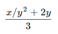

# 1.1 编程的基本元素

> - 来源：[The Elements of Programming](https://sicp.comp.nus.edu.sg/chapters/2)
> - 译者：[塔希](https://github.com/iheyunfei/)
> - 协议：[CC BY-NC-SA 4.0](http://creativecommons.org/licenses/by-nc-sa/4.0/)

---

一种强大的编程语言不仅仅是操控电脑完成一些任务的手段，同样也表现的犹如一种框架，我们在其中组织存在于自身大脑中关于计算过程的想法。因此，当我们描述一门编程语言时，我们应该特别关注语言提供给我们的 **如何组合简单从而形成复杂** 的手段。任何一门强大的语言都提供了三种机制来帮助做到这点：

- **基本表达式**，代表一门编程语言所关心的最简单的元素
- **组合的手段**，通过这些手段，我们可以于简单的元素之上构建复合的元素，以及
- **抽象的手段**——通过这些手段，我们可以对复合元素命名，并且以单元为个体来操控复合元素。

编程时，我们与这两种元素打交道——函数和数据（稍后，我们会发现它们之间的的区别并没有那么明显）。通俗的讲，数据是一种需要被我们操控、处理的“东西”，函数则是一系列规则（对于如何操控、处理数据）的描述。因此，任何强力的编程语言都要有能力表述基本的数据和函数，并且，拥有对函数和数据进行组合和抽象的手段。

本章中，为了可以专注于构建函数的规则，我们仅仅处理简单的数值型数据<sup id="1-1a1">[[1]](#1-1b1)</sup>。随后的章节中，我们会认识到这些规则适用于复合型数据。

<div id="1-1b1">

[[1]](#1-1a1) The characterization of numbers as simple data is a barefaced bluff. In fact，the treatment of numbers is one of the trickiest and most confusing aspects of any programming language. Some typical issues involved are these: How large a number can we represent? How many decimal places of accuracy can we represent? Above and beyond these questions，of course，lies a collection of issues concerning roundoff and truncation errors—the entire science of numerical analysis. Since our focus in this book is on large-scale program design rather than on numerical techniques，we are going to ignore these problems. The numerical examples in this chapter will exhibit the usual roundoff behavior that one observes when using arithmetic operations that preserve a limited number of decimal places of accuracy in noninteger operations.

</div>

## 1.1.1 表达式

当想要使用JavaScript开始编程时，一种简单的方式是通过与内建于浏览器(也就是你正在浏览本页面使用的)的JavaScript解释器进行互动。JavaScript程序仅仅是可以被执行的JavaScript语句。我们已经编写好了一些语句，显示在下方的可以通过鼠标点击深色区域内。通过点击深色区域的JavaScript语句，一个可以对JavaScript语句进行求值的解释器会显示出来，并且可以展示求值后的结果。顺便一提，实现这些功能的程序同样由JavaScript编写；我们称呼这个鼠标点击程序为Script。<sub>(译者注：鉴于兼容性的原因，请通过点击区域下方的 **Click here to run** 来访问对应的JavaScript程序)</sub>

有一种JavaScript语句类型称为表达式语句，由一个表达式尾随一个分号组成。一个简单的表达式可以是个数字(更精确的说，这个表达式是由一个数学型符号构成，其代表着一个以10为基数的数值。)如果你想要求Script程序显示这个表达式的求值结果

```js
486;
```
[Click here to run](https://sourceacademy.nus.edu.sg/playground#chap=1&prgrm=FAFgHAbA3MxA)

通过点击 Click here to run，浏览器会创建一个新的标签页，新的标签页中包含着对应的JavaScript语句和对语句进行求值的选项。赶快点击 Click here to run，然后看看会发生什么吧！

代表着数字的表达式可以通过运算符(如 + 或 * )组合，形成一个复合表达式，表示把这些数字应用到运算符对应的的基本函数上。

例如，通过点击 Click here to run，求值下列的任何表达式语句<sup id="1-1-1a1">[[1]](#1-1-1b1)</sup>:

```js
137 + 349;
```

[Click here to run](https://sourceacademy.nus.edu.sg/playground#chap=1&prgrm=FARgzA7ABA1FYBYCcBuYwg)

```js
1000 - 334;
```

[Click here to run](https://sourceacademy.nus.edu.sg/playground#chap=1&prgrm=FARgDBAEC0kMxwCwG5jCA)

```js
5 * 99;
```

[Click here to run](https://sourceacademy.nus.edu.sg/playground#chap=1&prgrm=FAVgBAVGCc0NzGEA)

```js
10 / 5;
```

[Click here to run](https://sourceacademy.nus.edu.sg/playground#chap=1&prgrm=FARgDABA9BCsDcxhA)

```js
2.7 + 10;
```

[Click here to run](https://sourceacademy.nus.edu.sg/playground#chap=1&prgrm=FAJgdA7ABA1FCMAGA3MYQ)

上述将其他表达式作为自身组成部分的表达式被称为*复合式 combinations*。一个有着 *运算符 operator* 在中间，*运算对象 operand* 在两边形状的复合表达式被称为 *运算复合式 operator combinations*。一个运算复合式的求值结果取决于运算符对应的函数，以及被应用于函数由运算对象所代表的*参数 arguments*。

上述关于将运算符放置于运算对象中间位置的约定被称为 *中缀 infix* 记法。它与读者在上学时熟悉的常规数学记法一样。和数学一样，运算复合式是可以 *嵌套 nested* 的，也就是说，运算复合式接受的参数同样也可以是运算复合式。


```js
(3 * 5) + (10 - 6)
```

[Click here to run](https://sourceacademy.nus.edu.sg/playground#chap=1&prgrm=FACgzABAVBCsCUEDUEQEYAMEC0EBs8A3MMEA)

按照惯例，括号被用来包裹运算复合式来避免歧义。JavaScript同样遵守这个约定，当省略括号时，乘法和除法之间的绑定——即优先级，高于加法和减法。

```js
3 * 5 + 10 / 2;
```

[Click here to run](https://sourceacademy.nus.edu.sg/playground#chap=1&prgrm=FAZgBAVGCsYNRgIwAYwHowCYDcxhA)

等价于

```js
(3 * 5) + (10 / 2)
```

[Click here to run](https://sourceacademy.nus.edu.sg/playground#chap=1&prgrm=FACgzABAVBCsCUEDUEQEYAMED0EBM8A3MMEA)


我们称这种情况为 * 和 / 有着比 + 和 - 更高的优先级。对于按序出现的加法和减法的序列，其阅读顺序由左到右。对于按序出现的乘法和除法的序列也是一样。因此，

```js
3 / 5 * 2 - 4 + 3;
```

[Click here to run](https://sourceacademy.nus.edu.sg/playground#chap=1&prgrm=FAZgBA9GCsYFRgExgLRgCxgNRhAbmGCA)

等价于

```js
(((3 / 5) * 2) - 4) + 3;
```

[Click here to run](https://sourceacademy.nus.edu.sg/playground#chap=1&prgrm=FACjGYAIHpIVgJSQFSQExILSQCxINSTgDcwwQA)


我们称 +，-，* 和 / 为左结合运算符。

原则上，针对JavaScript解释器的求值能力来讲，表达式的嵌套深度是没有限制的。但对于我们人类来说，我们甚至可以被一些相对简单的嵌套表达式搞迷糊，例如

```js
3 * 2 * (4 + (3 - 5)) + 10 * (27 / 6);
```

[Click here to run](https://sourceacademy.nus.edu.sg/playground#chap=1&prgrm=FAZgBAVGBMlgFAFjAageAtGArASl6mAIwAMc80A7GAPRgBsuA3MMEA)

解释器则能很容易的求值出57。不过，我们可以通过以下这种方式书写表达式，帮助我们

```js
3 * 2 * (4 + (3 - 5)) 
+ 
10 * (27 / 6);
```

[Click here to run](https://sourceacademy.nus.edu.sg/playground#chap=1&prgrm=FAZgBAVGBMlgFAFjAageAtGArASl2MGsAIwAMc80A7GAPRgBsuA3MMEA)


从视觉上将表达式的主要组成部分分开。

解释器在一个基本的循环中进行运算：解释器得到来自浏览器的语句，对语句进行求值，打印求值的结果。这种运算模式通常被表达为，解释器运行在一个 *读入-求值-打印 循环 read-eval-print loop* 中。要特别注意的是，完全显式的打印任何语句的值是不必要的。

<div id="1-1-1b1">

[[1]](#1-1-1a1) 注意分号 **;** 使得JavaScript解释器将此表达式当作一个语句，因此被认为是一个完整的程序。但是，JavaScript本身并没有严格的要求任何时候都要带上分号，有时候可以忽略。但在本书中，我们绝不会把分号当作可选的，并且会指出哪些语句带了分号，哪些没有带。

</div>

## 1.1.2 命名和环境 Environment

对于一门编程语言来说，相当关键的一方面就是语言提供的，使用命名来指代一个计算对象的手段，而我们所接触的第一个这种手段就是*常量 constants*。我们称这种命名标识了一个常量，其 *值 value* 是一个对象。<sub>译者注：读者需要注意的是，此对象并非特指JavaScript中的被称为 *对象 object* 的某种数据类型，而是一种泛指，任何可以被指替的值都可以被称为对象</sub>。

在JavaScript中，我们使用 *常量声明 constant declarations* 语句，键入

```js
const size = 2;
```

使得解释器将值 **2** 与命名 **size** 关联起来。常量声明语句的作用就是创造关联，而非计算出一个表达式语句特定的值。JavaScript的语言规范要求对 *常量声明* 语句进行求值结果为 *undefined*

一旦命名 **size** 与 数字 **2** 关联起来，我们可以通过命名 **size** 来指代值 **2**

```js
size
```

or

```js
5 * size;
```

当然，在命名 **size** 可以被用在表达式中之前，JavaScript解释器必须先执行 **size** 的常量声明。对于本书来说，为了简洁性，需要被事先执行的声明语句被刻意忽略了。不过，为了查看求值后的结果，你可以点击 Click here to run。在浏览器新打开的标签页中的程序会包含所有需要的语句。因此，作为点击下方的结果

```js
5 * size;
```

一个包含着所有需要语句的新标签页会被打开，其内容如下所示

```js
const size = 2;
5 * size;
```

注意到，JavaScript语句可以按序放置成一个序列。解释器会按序求值序列，然后将这个序列的最后一部分当作这个序列的值。

这里有些更进一步的关于 **const** 的使用示例

```js
const pi = 3.14159;
```

```js
const radius = 10;
```

```js
pi * radius * radius;
```

```js
const circumference = 2 * pi * radius;
```

```js
circumference;
```

常量声明是我们语言中最简单的抽象手段，它允许我们能使用简单的命名来指代复合运算结果，例如上方的 circumference。通常，计算对象可能有着非常复杂的结构，当我们想要使用这种计算对象时，如果每次都要记住和重复它们的细节，这会对我们造成的极度的不便。实际上，构建复杂的程序也就是逐步地构建复合的、渐增复杂度的计算对象。我们的解释器使得这种逐步构建程序的方式变得容易，因为通过连续地与程序进行交互，我们可以渐进的构建起命名-对象之间的联系。

需要明确的一点——在命名和值之间创建联系，在稍晚的时候使用它们意味着解释器需要某种记忆机制来保持追踪 命名-值 间的配对。这种记忆机制被称为环境(更准确的讲是全局环境，因为我们即将看到一个计算过程可能包含着大量不同的环境)。<sup id="1-1-2a1">[[1]](#1-1-2b1)</sup>

<div id="1-1-2b1">

[[1]](#1-1-2a1) 第三章会说明，对于理解解释器如何工作和如何实现解释器，环境的概念是至关重要的。

</div>

<div id="title1-1-3"></div>

## 1.1.3 运算复合式的求值

在本章节，我们的目标是将计算的描述(与其他概念)孤立出来。比如说，让我们思考下运算复合式的求值过程。解释器按照下列规则运行：

- 为了求值一个运算复合式，遵循以下步骤：
    1. 求值复合式的运算对象表达式
    2. 调用运算符代表的函数，将其应用于参数——即运算对象所代表的值，

即使如此简单的求值规则也揭示了关于一般计算的一些要点。首先，注意流程的第一步指明了，为了完成对运算符的求值，我们首先要对运算复合式的每一个运算对象进行求值。至此，求值规则自然而然的带有了递归性；也就是说，求值规则的步骤暗示了调用规则本身的需要。<sub>译者注：即将求值规则应用于一个运算复合式，其第一步是将本规则应用于其子运算复合式，而对于被应用的子运算复合式，同样对其子运算复合式递归的应用本规则。</sub>

注意，对于多层嵌套的复合式(通常被认为相当复杂的计算过程)，这种递归的思想在表达如何对其求值是相当简洁的。举个例子，对下方语句求值

```js
(2 + 4 * 6) * (3 + 12);
```

要求将求值规则应用于四个不同的复合式。将复合式以树的形式表示出来，我们可以得到一张求值过程的图片，见[图1.1](#figure1-1)。每个节点代表一个复合式，由其延伸出的枝干分别指向运算复合式的运算符和运算对象。末端节点(就是没有枝干的节点)代表着运算符或者数字。从树的角度来观察求值过程，可以看出运算对象的求值结果，从末端节点开始，向上方“渗出”，逐层的结合起来。通常，对于处理层次化或树形的对象来说，我们会看到递归是一种非常强大的技术。实际上，“向上方渗出值”形式的求值规则通常被称为 *树形积累 tree accumulation*。

<div id="figure1-1" align="center">


<p>图1.1 树形表示，展示了每个子表达式的值</p>

</div>

接下来，值得注意的是，重复应用求值规则的第一步，总将我们带到需要进行求值的基本表达式，如数字或命名，而非其他的运算复合式。我们作出以下规定来处理这些基本情况

- 数字的值就是数字本身代表的数值，
- 命名的值是，在某种环境下，与此命名相关联的那个对象

注意，环境的作用就是决定表达式中各个命名的含义。在JavaScript中，谈论 **x + 1** 的值是多少，却没有提供环境信息指明命名x的含义，毫无意义。我们将会在第三章看到，*环境 environment* 是一个普遍性的概念，在解释器求值时提供了一个 *上下文 context*。因此，环境对于理解程序如何执行是至关重要的。

注意，上述求值规则并不处理常量声明。举个例子，求值 **const x = 3;** 并没有将 命名x 和 数字3 两个参数应用到运算符 = 上，因为常量声明的目的是在命名x与某个值之间创建一种联系。(也就是说，常量声明 **const x = 3;** 中的 **x = 3** 并不是运算复合式。)

在常量声明中的字符串 “**const**” 之所以加粗，是为了指明 const 是JavaScript中的一个 *关键字 keyword*。不同关键字有着其特殊的含义，因此是保留的，不能被用作命名。一个关键字或多个关键字的组合指示了解释器如何特殊对待这些单独的语句。每种关键字语句都有属于自身的求值规则。各种各样的语句(每一个都关联着自身的求值规则)构成了一门编程语言的语法。

<div id="title-1-1-4">

## 1.1.4 函数

我们已经在JavaScript语言中见过了在任何强大编程语言中都会出现的元素：

- 作为基础数据和函数的数字和和算术运算符。
- 可以嵌套的复合式提供组合各种操作的手段。
- 可以在命名和值之间创建联系的常量声明，提供了一种受限的抽象手段

现在我们将要学习 *函数声明 function declarations*，一种更加强大的抽象技术，使得复合操作可以被命名和以单元的形式引用。

我们的学习开始于，研究如何表达“平方 squaring”的想法。我们也许会说，“要求平方某物，即要求它乘以自身”。在我们的编程语言中，平方的表达如下：

```js
function square(x) {
    return x * x;
}
```

我们可以按照以下的方式理解这一表述

```js
function square(    x   ) { return x    *     x; }
//  ^       ^       ^         ^    ^    ^     ^
// To    square something， take   it times itself.
// 为了  平方   某物         要求   它  乘以  自身
```

这里，我们有了一个名叫 **square** 的 *复合函数 compound function*。这个函数代表着将一个事物乘以自身的操作。被乘的事物被给予了一个本地命名 **x**，其作用就和自然语言中的代词相同。对函数声明语句求值会创建一个复合函数，然后将其与命名 **square** 联系在一起。<sup id="1-1-4a1">[[1]](#1-1-4b1)<sup>

我们最简单的一个函数声明格式如下

> function *name* ( *parameters* ) { return *expression*; }

> function *函数名* ( *参数* ) { return *表达式*; }

*函数名 name* 是一个将会与函数联系在一起的符号，存储在环境中。<sup id="1-1-4a2">[[2]](#1-1-4b1)</sup> *参数 parameters* 是存在于函数内部的命名，指向函数对应位置的参数。在关键字 **return** 后的 *expression* 是 *返回表达式 return expression*，当函数被调用时，其形式参数被给予的实际参数替换，返回表达式会产生相应的值。<sup id="1-1-4a3">[[3]](#1-1-4b1)</sup>参数组织在括号内，由逗号隔开，就和它们在声明后的函数被调用时一样。

在声明了 square 函数后，现在，我们可以在 *函数调用表达式 function application expression* 中使用这个函数。通过分号，我们可以将函数调用表达式转换成一个语句：

```js
square(21);
```

命名 **square** 是调用过程中的函数表达式，**21** 是参数表达式。


```js
square(2 + 5);
```

现在，参数变成了一个复合表达式，即表达式 **2 + 5**。

```js
square(square(3));
```

当然，函数调用表达式也可以被当作参数。

同样的，我们可以将 square 当作基本构件去声明其他函数。举个例子，x<sup>2</sup>+y<sup>2</sup> 可以被表达为

```js
square(x) + square(y);
```

很简单地，我们可以声明一个 sum_of_squares 函数，在给定两个数字参数后，返回它们的平方和

```js
function sum_of_squares(x，y) {
    return square(x) + square(y);
}
```

现在，我们可以将 sum_of_squares 当作基本构件去构造更高层次的函数：

```js
function f(a) {
    return sum_of_squares(a + 1，a * 2);
}
```
函数调用如 **sum_of_squares(3，4)**，是继运算复合式后，我们遇到的第二种关于表达式嵌套表达式的复合式。除了复合函数之外，JavaScript还提供了许多内置于解释器中的基本函数。比如函数 **math_log**，它计算给定参数的自然对数。<sup id="1-1-4a4">[[4]](#1-1-4b1)</sup>求值函数调用 **math_log(1)** 会得到结果0。确实，人并不能通过查看 **sum_of_squares** 函数的定义，判断出 **square** 函数是像 **math_log** 函数一样内建于解释器，还是说被定义为复合函数。

<small id="1-1-4b1">

[[1]](#1-1-4a1) 注意，这里有两种不同操作被绑定在一起了：创建函数，给这个函数命名。将这两个概念分开是很重要的——不给予名字的情况下创建函数和，对已创建的函数命名。我们会在[*这里应连接到*1.3.2]()节看到怎么做。

[[2]](#1-1-4a2) 贯穿本书，我们在描述程序的语法时，会使用斜体符号(比如 *name*)作为表达式中的占位符，每一个都代表着表达式在被实际使用时需要被填充的位置。

[[3]](#1-1-4a3) 在下一节中，我们将看到函数体可以是一系列语句。在这种情况下，解释器依次求值序列中的每个语句，直到 return语句 确定函数调用的值。

[[4]](#1-1-4a4) 本书使用的 Source 编程语言引入了命名 math_* 来指代JavaScript中Math对象里所有的函数和常量。


</small>

## 1.1.5 函数调用的代换模型

为了求值一个调用复合式 application combination，解释器遵循着与求值运算复合式相似的过程，描述于章节[1.1.3](#title1-1-3)。也就说解释器求值复合式中的每一个元素，然后将参数(即调用复合式参数表达式的求值结果)应用到函数(即函数表达式的求值结果)上。

更详细地讲，在求值调用复合式时，解释器按照以下规则运行：

- 为了求值下方这种形式的调用复合式
- > *function-expression* ( *argument-expressions* )
- 执行以下步骤:
    1. 求值调用复合式中的 *函数表达式 function-expression*，得到将被调用的函数
    2. 求值调用复合式的 *参数表达式 argument-expressions*
    3. 将函数应用于参数:
        - 如果是基本函数，我们只需简单地将相应的数学函数应用于参数。
        - 如果是复合函数，在形式参数被实际参数替换后，我们求值 return 处的表达式。

为了说明这个过程，我们来求值这个调用复合式

```js
f(5);
```

求值命名 f，得到一个函数(于[1.1.4](#title-1-1-4)节声明)。求值参数表达式 5，产生对应的参数值 5。现在，我们获取到函数 f 在 return 处的表达式

```js
sum_of_squares(a + 1，a * 2)
```

在此，我们将形式参数 a 替换成实际参数 5

```js
sum_of_squares(5 + 1，5 * 2)
```

因此，问题被简化成对带有两个参数和函数表达式 **sum_of_squares** 的调用复合式求值的问题。对这个复合式的求值包含了三个子问题。我们必须求值函数表达式来得到将被调用的函数，我们同样必须求值参数表达式来得到实际参数。现在 **5 + 1** 产生值 **6**，**5 * 2** 产生值 **10**，所以我们必须将 **6** 和 **10** 应用于函数 **sum_of_squares**。这些值会替换 **sum_of_squares** return 处表达式的形式参数 **x** 和 **y**，表达式被简化成

```js
square(6) + square(10)
```
如果我们将 square 函数的声明展开一次，再次被简化为

```js
(6 * 6) + square(10)
```

在进行过乘法后，简化为

```js
36 + square(10)
```

第二次 square 函数调用后，产生出

```js
36 + (10 * 10)
```

再次进行过乘法后，简化为

```js
36 + 100
```

最终进行加法，得到

```js
136
```

我们刚刚描述过程被称为函数调用的代换模型。就本章的函数而言，这个代换过程作为确定函数“意义”的模型足够了。但是，有两点值得强调：

- 代换模型的目的是帮助我们思考函数调用，而非提供一个，在实际上，解释器如何工作的描述。典型的解释器并不会通过修改函数定义时的文本来替换形式参数的值。实际上，对形式参数的代换是通过使用本地环境完成的。当我们在第三章和第四章，详细研究解释器的实现时，我们会讨论与之相关的完整内容。

- 随着本书进度不断增加，我们将提供一系列越来越精细的解释器如何工作的模型，最后在第5章中实现完整的解释器和编译器。代换模型只是这些模型中的第一个——一个开始正式思考求值过程的途径。一般而言，在对科学和工程中的现象进行建模时，我们从简化的，不完整的模型开始。当我们详细研究事物时，这些简单的模型变得不充分，必须用更精细的模型来代替。代换模型也不例外。特别是，当我们在第三章讨论使用带有可变数据的函数时，我们将看到代换模型崩溃，必须替换为更复杂的函数调用模型。<sup id="1-1-5a1">[[1]](#1-1-5b1)</sup>

### 应用序与正则序

根据以上对求值过程的描述，解释器首先求值函数表达式和参数表达式，然后将求值函数表达式后的结果应用于求值参数表达式后的结果。但是，这并不是唯一的求值方法。另一种求值模型只在运算对象的值被实际需要的时候再进行求值。这种求值模型首先将参数处的表达式替换掉，直到获得一个仅包含基本运算符的表达式，然后再开始执行求值过程。如果我们使用这种方法，那么以下表达式的求值

```js
f(5)
```

将会按照以下序列进行

```js
sum_of_squares(5 + 1，5 * 2)

square(5 + 1)  +  square(5 * 2)

(5 + 1) * (5 + 1) + square(5 * 2)

(5 + 1) * (5 + 1) + (5 * 2) * (5 * 2)
```

紧接着进行规约

```js
6 * (5 + 1) + (5 * 2) * (5 * 2)
6 * 6 + (5 * 2) * (5 * 2)
36 + (5 * 2) * (5 * 2)
36 + 10 * (5 * 2)
36 + 10 * 10
36 + 100
136
```
最后的求值结果与先前的求值模型相同，但是其中的处理过程是不同的。特别地，表达式 **5 + 1** 和 **5 * 2** 都被求值了两次，对应于以下表达式的归约

```js
x * x
```

其中 **x** 被 **5 + 1** 和 **5 * 2** 替换掉。

这种“完全展开然后归约”的求值方法被称为 *正则序求值 normal-order evaluation*，与解释器实际使用的“先求值参数后应用”的 *应用序求值 applicative-order evaluation* 相比。可以看出，对于可以通过替换模拟且能产生出合法值的函数调用(包括本书前两章的所有函数)，正则序和应用序的求值结果是相同的。(参见练习1.5，一个关于“非法值”的例子，正则序和应用序不会产生相同的结果。)

JavaScript使用应用序求值，一部分是因为由于避免了刚才讲的重复求值，因此带来的额外的效率，更重要的是，当我们遇到无法使用替换模型模拟的函数时，正则序求值处理起来会变得非常复杂。

不过，在另一方面，正则序求值也可以成为一个极度有价值的工具，我们将会在第三章和第四章研究它的蕴意。<sup id="1-1-5a2">[[2]](#1-1-5b1)</sup>


<div id="1-1-5b1">

[[1]](#1-1-5a1) Despite the simplicity of the substitution idea，it turns out to be surprisingly complicated to give a rigorous mathematical definition of the substitution process. The problem arises from the possibility of confusion between the names used for the parameters of a function and the (possibly identical) names used in the expressions to which the function may be applied. Indeed，there is a long history of erroneous definitions of substitution in the literature of logic and programming semantics. See Stoy 1977 for a careful discussion of substitution.

[[2]](#1-1-5a2) 在第三章，我们将会介绍 *流处理 stream processing*，一种通过混入一种受限的正则序求值形式，来处理明显“无穷尽”数据结构的方法。

</div>

## 1.1.6 条件表达式和谓词

现在，对于我们可以声明的函数类别来说，其表达能力是比较受限的，因为我们没有方法作检验，然后根据检验的结果执行不同的运算。例如，我们无法声明一个计算数字绝对值的函数，因为绝对值函数需要通过检验数字是负还是非负，根据以下图示的规则，在每种状况下采取不同的行为

<div align="center">


</div>

这种结构是一个 *情景分析 case analysis*，可以使用如下所示的JavaScript中的 *条件表达式 conditional expression* 来表述：

<div id="ch1-1-6-abs"></div>

```js
function abs(x) {
    return x >= 0 ? x : -x;
}
```

条件表达式的常规形式是

> *predicate* ? *consequent-expression* : *alternative-expression*

> *谓词* ? *结果-表达式* : *替代-表达式*

条件表达式开始于一个 *谓词 predicate* —— 换句话说，一个表达式，这个表达式的值被解释为 *true* 或 *false*，两个存在于JavaScript中，*布尔 boolean* 类型的特殊值
。<sup id="1-1-6a1">[[1]](#1-1-6b1)</sup> 注意基本布尔表达式 **true** 和 **false** 简单直接地求值为布尔值 *true* 和 *false*。*谓词* 后面尾随着一个问号，*结果-表达式 consequent-expression*，一个冒号，*替代-表达式 alternative-expression*。

为了求值一个条件表达式，解释器首先求值表达式的 *谓词* 部分。如果 *谓词* 求值为 *真 true*，解释器则求值 *结果-表达式 consequent-expression*。否则，解释器求值 *替代-表达式 alternative-expression*。

*谓词* 既可以指代返回 *true* 或 *fasle* 的函数，也可以指代求值为 *true* 或 *fasle* 的表达式。绝对值函数 **abs** 使用了基本谓词 **>=**。这个谓词需要两个数字作为参数，然后检测第一个数字是否大于等于第二个数字，根据结果返回 *true* 或 *fasle*。

JavaScript提供了类似大量类似 **>=** 的基本谓词，包括 **>，<，<=，** 和 **===**。除了这些基本谓词，还有所谓逻辑组合运算，使得我们能够构建复合谓词。经常被使用的三种逻辑组合运算是这些：

- *表达式<sub>1</sub>* **&&** *表达式<sub>2</sub>*：解释器求值 *表达式<sub>1</sub>*。 如果求值为 *false*，则整个表达式的值为 *false*，并且 *表达式<sub>2</sub>* 不会被求值。如果 *表达式<sub>1</sub>* 求值为 *true*，则整个表达式值的等于 *表达式<sub>2</sub>* 的值。

- *表达式<sub>1</sub>* **||** *表达式<sub>2</sub>*：解释器求值 *表达式<sub>1</sub>*。如果求值为 *true*，则整个表达式的值为 *true*，并且 *表达式<sub>2</sub>* 不会被求值. 如果 *表达式<sub>1</sub>* 求值为 *false*，则整个表达式值的等于 *表达式<sub>2</sub>* 的值。

- **!** *表达式*：当表达式求值为 *false* 时，整个表达式求值为 *true*，如果是 *false* 则相反.

注意 **&&** 和 **||** 的求值规则和诸如 + 这样的数学运算符并不一样，因为右侧的表达式并非一定会被求值。另一方面，运算符 **!** 遵循着[1.1.3](#title1-1-3)节的求值规则。**!** 是一个 *一元 unary* 运算符，这表示它仅仅接受一个参数。而当前我们遇到数学运符号都是 *二元 binary* 的，接受两个参数。运算符 **!** 的位置在其参数之前；我们称之为 *前缀运算符 prefix operator*。另一个前缀运算符是一元运算符“减”，本小节开始部分的[abs](#ch1-1-6-abs)函数中的表达式 **-x** 就是一个例子。

作为一个展示这些谓词怎么使用的例子，一个判断范围在5 < x < 10之间的数字x的条件可以被表述为

```js
x > 5 && x < 10
```

注意，对于比较运算符 **>** 和 **<** 来说，二元运算符 **&&** 相有着相对低的运算优先级。

另外一个例子，我们可以声明一个谓词函数，来检测一个数字是否等于另一个数字。

```js
function not_equal(x，y) {
    return x > y || x < y;
}
```

等价于

```js
function not_equal(x，y) {
    return !(x >= y && x <= y);
}
```

注意，当运算符 **!==** 接受两个数字参数时，其行为和函数 **not_equal** 一样。

### Exercise

#### Exercise1.1

以下是一系列语句。在你求值确定答案之前，预测下这些语句的求值结果。

```js
10;
```

```js
5 + 3 + 4;
```

```js
9 - 1;
```

```js
6 / 2;
```

```js
2 * 4 + (4 - 6);
```

```js
const a = 3;
```

```js
const b = a + 1;
```

```js
a + b + a * b;
```

```js
a === b;
```


```js
b > a && b < a * b 
   ? b : a;
```


```js
a === 4 ? 6 : b === 4 ? 6 + 7 + a : 25;
```


```js
2 + (b > a ? b : a);
```


```js
(a > b
 ? a
 : a < b
   ? b
   : -1)
*
(a + 1);
```

Note that the statement

```js
a === 4 ? 6 : b === 4 ? 6 + 7 + a : 25;
```

consists of two conditional expressions，where the second one forms the alternative of the first one. If you want to make that clear，you can indent the lines like this:

```js
a === 4
? 6
: b === 4 
  ? 6 + 7 + a
  : 25;
```

<details>

<summary>
点击查看答案
</summary>

无

</details>

#### Exercise1.2

Translate the following expression into JavaScript

```
5+4+(2−(3−(6+4/5)))
————————————————————
    3(6−2)(2−7)
```

<details>

<summary>
点击查看答案
</summary>

```js
(5 + 4 + (2 - (3 - (6 + 4 / 5)))) 
/
(3 * (6 - 2) * (2 - 7));
```

</details>

#### Exercise1.3

Declare a function that takes three numbers as arguments and returns the sum of the squares of the two larger numbers.

<details>

<summary>
点击查看答案
</summary>

```js
function f(x，y，z) {
   return square(x) + square(y) + square(z) -
          // subtract the square of the smallest
          square(x > y ? (y > z ? z : y) : (x > z ? z : x));
}
```

</details>

#### Exercise1.4

Observe that our model of evaluation allows for application combinations whose function expressions are compound expressions. Use this observation to describe the behavior of the following function:

```js
function plus(a，b) { return a + b; }
function minus(a，b) { return a - b; }
function a_plus_abs_b(a，b) {
    return (b >= 0 ? plus : minus)(a，b);
}
```

Note that in the conditional expression，we cannot directly use the operators + and - instead of the names plus and minus because in infix notation，only operator symbols are allowed in the middle，not compound expressions.<sup id="1-1-6a2">[[2]](#1-1-6b1)</sup>

<details>

<summary>
点击查看答案
</summary>

According to section 1.1.5，evaluation of a application expression proceeds as follows:

- Evaluate the function expression of the application combination，resulting in the function to be applied.
- Evaluate the argument expressions of the combination.
- Evaluate the return expression of the function with each parameter replaced by the corresponding argument.

Thus the evaluation of the application expression a_plus_abs_b(5，-4) (1) evaluates a_plus_abs_b，resulting in the function given above，and (2) the arguments are already values. So we need to evaluate (3) the return expression of the function，with the parameters replaced by the arguments，thus: (-4 >= 0 ? plus : minus)(5，-4). With the same rules，we need to (1) evaluate the function expression，which in this case is the conditional expression -4 >= 0 ? plus : minus. Since the predicate evaluates to false，the function expression evaluates to minus. The arguments，again (2) are already values. Thus we end up evaluating (3) the body of minus with the parameters a and b replaced by 5 and -4，respectively，resulting in 5 - (-4)，which will finally evaluate to 9.

</details>

#### Exercise1.5

Ben Bitdiddle has invented a test to determine whether the interpreter he is faced with is using applicative-order evaluation or normal-order evaluation. He declares the following two functions :

```js
function p() {
    return p();
}

function test(x，y) {
    return x === 0 ? 0 : y;
}
```

Then he evaluates the statement

```js
test(0，p());
```

What behavior will Ben observe with an interpreter that uses applicative-order evaluation? What behavior will he observe with an interpreter that uses normal-order evaluation? Explain your answer. (Assume that the evaluation rule for conditional expressions is the same whether the interpreter is using normal or applicative order: The predicate expression is evaluated first，and the result determines whether to evaluate the consequent or the alternative expression.)

<details>

<summary>
点击查看答案
</summary>

> In applicative-order evaluation of test(0，p())，we need to evaluate the argument expressions before we can evaluate the return expression of the function test. The evaluation of the argument expression p() will not terminate，however: It will keep evaluating application expressions of the form p()，and thus the evalution of test(0，p()) will not produce a legitimate value. In normal-order evaluation，on the other hand，the function application test(0，p()) would immediately evaluate the return expression of the function test，x === 0 ? 0 : y after replacing the parameter x with 0 and y with p(). The result of the replacing would be 0 === 0 ? 0 : p(). The evaluation of the predicate 0 === 0 results in true and thus the conditional expression evaluates to 0，without any need to evaluate p().

</details>

<div id="1-1-6b1">

[[1]](#1-1-6a1) In JavaScript，other values are automcatically converted into true and false according to conversion rules，but we choose not to make use of these conversion rules in this book.

[[2]](#1-1-6a2) For an expression of the form a (b > 0 ? + : -) b the JavaScript interpreter would not know the precedence of the operator between a and b，and therefore such expressions are not allowed.

</div>

## 1.1.7 例子：牛顿法求平方根

前文所介绍的函数更像常规数学意义上的函数。它们通过一个多个参数确定一个值。但是，在数学函数和计算机函数之间有个很大的差别。计算机函数必须是切实可行的。

举个恰当的例子，思考下关于如何计算平方根的问题。我们可以定义一个 **square-root** 函数如

<div align="center">


<sub>
译: √x = 某个 y 且能够满足 y≥0 and y<sup>2</sup>=x
</sub>

</div>

这描述了一个在数学意义上正确无比的函数。我们能够使用这个函数来判别一个数字是否是另一个数字的平方根，或得到一些关于平方根的一般性事实。然而，在另一方面，这个定义并没有描述出一个计算机函数。确实，它并没有告诉我们如何去找一个给定数字的平方根。仅仅用类JavaScript的伪代码重述这个定义并不会带来任何帮助：

```js
function sqrt(x) {
    return the y with y >= 0 &&
                      square(y) === x;
}
```

这仅仅是重述了问题。

数学函数和计算机函数的对比，反映出了在描述事物的属性和描述如何去做某件事情之间，存在常规性差异，又或者说，通常被被称为，声明性知识与指令性知识之间的差异。在数学，我们通常关心声明性的(是什么)描述，而在计算机科学中，我们通常关心指令性(怎么做)描述。<sup id="1-1-7a1">[[1]]()</sup>

一个人如何计算出平方根？最通常使用的方式牛顿的逐步逼近法，牛顿法描述了任何时候，对于数字 x 的平方根，我们都有一个猜测值 y，我们通过计算 y 与 x/y 的平均值来进行一些简单的处理，从而来取得一个更好的猜测值(即更加接近实际的平方根)。<sup>[[2]]()</sup> 举个例子，我们可以向下文一样计算2的平方根。假设我们的初始猜测值是1：

<div align="center">


</div>

继续这个计算过程，我们可以获得越来越接近平方根的近似值。

现在，让我们用函数来形式化这个过程。我们的函数开始于一个开方数(它的平方根就是我们尝试计算出的答案)和一个猜测值。如果猜测值好到满足我们的目的，我们确定完成计算。如果不够好，我们必须用一个更好的猜测值来重复这个处理过程。我们可以将这些策略写成一个函数：

```js
function sqrt_iter(guess, x) {
    return good_enough(guess, x)
           ? guess
           : sqrt_iter(improve(guess, x), x);
}
```

一个猜测值可以通过计算开方数与旧猜测值的商，然后计算该商与旧猜测值的平均值来改进:

```js
function improve(guess, x) {
    return average(guess, x / guess);
}
```

以及

```js
function average(x,y) {
    return (x + y) / 2;
}
```

我们也需要确定我们所说的“足够好 good_enough”是什么意思。下文所述的做法是一个演示，但其并不是一个足够好的测试。(见练习1.7) 其思路是不断改进结果，直到结果的平方值与开方数之间的差值小于一个预先定好的误差值(这里是 0.001)。

```js
function good_enough(guess, x) {
    return abs(square(guess) - x) < 0.001;
}
```

最终，我们需要一种开始的方式。举个例子，我们总是可以将任何数字平方根的猜测值定为1：

```js
function sqrt(x) {
    return sqrt_iter(1, x);
}
```

如果我们键入这些声明到解释器中，我们可以像使用其他任意函数一样，使用 **sqrt** 函数：

```js
sqrt(9);
```

```js
sqrt(100 + 37);
```

```js
sqrt(sqrt(2) + sqrt(3));
```

```js
square(sqrt(1000));
```

这个 **sqrt** 程序同样阐明了，目前为止，我们已经介绍的简单函数式语言已经足够写出类似C 或 Pascal语言写出的纯粹的数学程序。这也许看起来令人惊讶，因为我们还没有介绍任何指示电脑重复做某件事的迭代(循环)结构。另一方面，函数 **sqrt_iter** 演示了如何在仅仅使用函数调用，不使用其他任何特殊结构的情况下，进行迭代运算。

### 练习

#### Exercise 1.6

Alyssa P. Hacker doesn't like the syntax of conditional expressions, involving the characters ? and :. Why can't I just declare an ordinary conditional function whose application works just like conditional expressions? she asks. Alyssa's friend Eva Lu Ator claims this can indeed be done, and she declares a conditional function as follows:

```js
function conditional(predicate, then_clause, else_clause) {		    
    return predicate ? then_clause : else_clause;
}
```

Eva demonstrates the program for Alyssa:

```js
conditional(2 === 3, 0, 5);
```

evaluates as expected to 5, and

```js
conditional(1 === 1, 0, 5);
```

evaluates as expected to 0. Delighted, Alyssa uses conditional to rewrite the square-root program:

```js
function sqrt_iter(guess, x) {
    return conditional(good_enough(guess, x),
                       guess,
                       sqrt_iter(improve(guess, x),
                                 x));
}
```

What happens when Alyssa attempts to use this to compute square roots? Explain.

<details>

<summary>
点击查看答案
</summary>

Any call of sqrt_iter leads immediately to an infinite loop. The reason for this is our applicative-order evaluation. The evauation of the return expression of sqrt_iter needs to evaluate its arguments first, including the recursive call of sqrt_iter, regardless whether the predicate evaluates to true or false. The same of course happens with the recursive call, and thus the function conditional never actually gets applied.

</details>

#### Exercise 1.7

The good_enough test used in computing square roots will not be very effective for finding the square roots of very small numbers. Also, in real computers, arithmetic operations are almost always performed with limited precision. This makes our test inadequate for very large numbers. Explain these statements, with examples showing how the test fails for small and large numbers. An alternative strategy for implementing good_enough is to watch how guess changes from one iteration to the next and to stop when the change is a very small fraction of the guess. Design a square-root function that uses this kind of end test. Does this work better for small and large numbers?

<details>

<summary>
点击查看答案
</summary>

The absolute tolerance of 0.001 is too large when computing the square root of a small value. For example, sqrt(0.0001) results in 0.03230844833048122 instead of the expected value 0.01, an error of over 200%.

On the other hand, for very large values, rounding errors might make the algorithm fail to ever get close enough to the square root, in which case it will not terminate terminates.

The following program alleviates the problem by replacing an absolute tolerance with a relative tolerance.

```js
const error_threshold = 0.01;

function good_enough(guess,x) {
    return relative_error(guess, improve(guess, x))
           < error_threshold;
}

function relative_error(estimate, reference) {
    return abs(estimate - reference) / reference;
}
```
</details>

#### Exercise 1.8

Newton's method for cube roots is based on the fact that if $y$ is an approximation to the cube root of $x$, then a better approximation is given by the value

<div align="center">



</div>

Use this formula to implement a cube-root function analogous to the square-root function. (In section 1.3.4 we will see how to implement Newton's method in general as an abstraction of these square-root and cube-root functions.)

<details>

<summary>
点击查看答案
</summary>

```js
function good_enough(guess, x) {
    return abs(cube(guess) - x) < 0.001;
}

function div3(x, y) {
     return (x + y) / 3;
}

function improve(guess, x) {
    return div3(x / (guess * guess), 2 * guess);
}

function cube_root(guess, x) {
    return good_enough(guess, x)
               ? guess
               : cuberoot(improve(guess, x), x);
}
```

</details>

<div id="1-1-7b1">

[[1]]() Declarative and imperative descriptions are intimately related, as indeed are mathematics and computer science. For instance, to say that the answer produced by a program is "correct" is to make a declarative statement about the program. There is a large amount of research aimed at establishing techniques for proving that programs are correct, and much of the technical difficulty of this subject has to do with negotiating the transition between imperative statements (from which programs are constructed) and declarative statements (which can be used to deduce things). In a related vein, an important current area in programming-language design is the exploration of so-called very high-level languages, in which one actually programs in terms of declarative statements. The idea is to make interpreters sophisticated enough so that, given "what is" knowledge specified by the programmer, they can generate "how to" knowledge automatically. This cannot be done in general, but there are important areas where progress has been made. We shall revisit this idea in chapter 4.

[[2]]() This square-root algorithm is actually a special case of Newton's method, which is a general technique for finding roots of equations. The square-root algorithm itself was developed by Heron of Alexandria in the first century a.d. We will see how to express the general Newton's method as a JavaScript function in section [1.3.4]().

</div>
