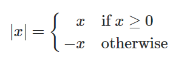

> 来源：[The Elements of Programming](https://sicp.comp.nus.edu.sg/chapters/2)

> 译者：[塔希](https://github.com/iheyunfei/)

> 协议：[CC BY-NC-SA 4.0](http://creativecommons.org/licenses/by-nc-sa/4.0/)

# 1.1 编程的基本元素

一种强大的编程语言不仅仅是操控电脑完成一些任务的手段，同样也表现的犹如一种框架，我们在其中组织存在于自身大脑中关于计算过程的想法。因此，当我们描述一门编程语言时，我们应该特别关注语言提供给我们的 **如何组合简单从而形成复杂** 的手段。任何一门强大的语言都提供了三种机制来帮助做到这点：

- **基本表达式**，代表一门编程语言所关心的最简单的元素
- **组合的手段**，通过这些手段，我们可以于简单的元素之上构建复合的元素，以及
- **抽象的手段**——通过这些手段，我们可以对复合元素命名，并且以单元为个体来操控复合元素。

编程时，我们与这两种元素打交道——函数和数据（稍后，我们会发现它们之间的的区别并没有那么明显）。通俗的讲，数据是一种需要被我们操控、处理的“东西”，函数则是一系列规则（对于如何操控、处理数据）的描述。因此，任何强力的编程语言都要有能力表述基本的数据和函数，并且，拥有对函数和数据进行组合和抽象的手段。

本章中，为了可以专注于构建函数的规则，我们仅仅处理简单的数值型数据<sup id="1-1a1">[[1]](#1-1b1)</sup>。随后的章节中，我们会认识到这些规则适用于复合型数据。

<div id="1-1b1">

[[1]](#1-1a1) The characterization of numbers as simple data is a barefaced bluff. In fact, the treatment of numbers is one of the trickiest and most confusing aspects of any programming language. Some typical issues involved are these: How large a number can we represent? How many decimal places of accuracy can we represent? Above and beyond these questions, of course, lies a collection of issues concerning roundoff and truncation errors—the entire science of numerical analysis. Since our focus in this book is on large-scale program design rather than on numerical techniques, we are going to ignore these problems. The numerical examples in this chapter will exhibit the usual roundoff behavior that one observes when using arithmetic operations that preserve a limited number of decimal places of accuracy in noninteger operations.

</div>

## 1.1.1 表达式

当想要使用JavaScript开始编程时，一种简单的方式是通过与内建于浏览器(也就是你正在浏览本页面使用的)的JavaScript解释器进行互动。JavaScript程序仅仅是可以被执行的JavaScript语句。我们已经编写好了一些语句，显示在下方的可以通过鼠标点击深色区域内。通过点击深色区域的JavaScript语句，一个可以对JavaScript语句进行求值的解释器会显示出来，并且可以展示求值后的结果。顺便一提，实现这些功能的程序同样由JavaScript编写；我们称呼这个鼠标点击程序为Script。<sub>(译者注：鉴于兼容性的原因，请通过点击区域下方的 **Click here to run** 来访问对应的JavaScript程序)</sub>

有一种JavaScript语句类型称为表达式语句，由一个表达式尾随一个分号组成。一个简单的表达式可以是个数字(更精确的说，这个表达式是由一个数学型符号构成，其代表着一个以10为基数的数值。)如果你要求Script程序显示这个表达式的求值结果

```js
486;
```
[Click here to run](https://sourceacademy.nus.edu.sg/playground#chap=1&prgrm=FAFgHAbA3MxA)

通过点击 Click here to run，浏览器会创建一个新的标签页，新的标签页中包含着对应的JavaScript语句和对语句进行求值的选项。赶快点击 Click here to run，然后看看会发生什么吧！

代表着数字的表达式可以通过运算符(如 + 或 * )组合，形成一个复合表达式，其表示把这些数字应用到相应的的基本函数上。

例如，通过点击 Click here to run，求值下列的任何表达式语句<sup id="1-1-1a1">[[1]](#1-1-1b1)</sup>:

```js
137 + 349;
```

[Click here to run](https://sourceacademy.nus.edu.sg/playground#chap=1&prgrm=FARgzA7ABA1FYBYCcBuYwg)

```js
1000 - 334;
```

[Click here to run](https://sourceacademy.nus.edu.sg/playground#chap=1&prgrm=FARgDBAEC0kMxwCwG5jCA)

```js
5 * 99;
```

[Click here to run](https://sourceacademy.nus.edu.sg/playground#chap=1&prgrm=FAVgBAVGCc0NzGEA)

```js
10 / 5;
```

[Click here to run](https://sourceacademy.nus.edu.sg/playground#chap=1&prgrm=FARgDABA9BCsDcxhA)

```js
2.7 + 10;
```

[Click here to run](https://sourceacademy.nus.edu.sg/playground#chap=1&prgrm=FAJgdA7ABA1FCMAGA3MYQ)

上述包含着其他表达式的表达式被称为组合式。一个有着 *运算符 operator* 在中间，*运算对象 operand* 在两边形状的组合式被称为 *运算符组合式 operator combinations*。一个运算符组合式的求值结果取决于运算符对应的函数，以及应用于函数的被称为*参数 arguments*的运算对象。

上述关于将运算符放置于运算对象中间位置的约定被称为 *中缀 infix* 记法。它与读者在上学时熟悉的常规数学记法一样。和数学一样，运算符组合式可以 *嵌套 nested* 的，也就是说，运算符组合式接受的参数同样也可以是运算符组合式。


```js
(3 * 5) + (10 - 6)
```

[Click here to run](https://sourceacademy.nus.edu.sg/playground#chap=1&prgrm=FACgzABAVBCsCUEDUEQEYAMEC0EBs8A3MMEA)

按照惯例，括号被用来包裹运算符组合式来避免歧义。JavaScript同样遵守这个约定，当省略括号时，乘法和除法之间的绑定——优先级，高于加法和减法。

```js
3 * 5 + 10 / 2;
```

[Click here to run](https://sourceacademy.nus.edu.sg/playground#chap=1&prgrm=FAZgBAVGCsYNRgIwAYwHowCYDcxhA)

等价于

```js
(3 * 5) + (10 / 2)
```

[Click here to run](https://sourceacademy.nus.edu.sg/playground#chap=1&prgrm=FACgzABAVBCsCUEDUEQEYAMED0EBM8A3MMEA)


我们称这种情况为 * 和 / 有着比 + 和 - 更高的优先级。对于按序出现的加法和减法的序列，其阅读顺序由左到右。对于按序出现的乘法和除法的序列也是一样。因此，

```js
3 / 5 * 2 - 4 + 3;
```

[Click here to run](https://sourceacademy.nus.edu.sg/playground#chap=1&prgrm=FAZgBA9GCsYFRgExgLRgCxgNRhAbmGCA)

等价于

```js
(((3 / 5) * 2) - 4) + 3;
```

[Click here to run](https://sourceacademy.nus.edu.sg/playground#chap=1&prgrm=FACjGYAIHpIVgJSQFSQExILSQCxINSTgDcwwQA)


我们称 +, -, * 和 / 为左结合运算符。

原则上，对JavaScript的解释器的求值能力来讲，表达式的嵌套深度是没有限制的。但对于我们人类来说，我们甚至可以被一些相对简单的嵌套表达式搞迷糊，例如

```js
3 * 2 * (4 + (3 - 5)) + 10 * (27 / 6);
```

[Click here to run](https://sourceacademy.nus.edu.sg/playground#chap=1&prgrm=FAZgBAVGBMlgFAFjAageAtGArASl6mAIwAMc80A7GAPRgBsuA3MMEA)

解释器则能很容易的求值出57。不过，我们可以通过以下这种方式书写表达式，帮助我们

```js
3 * 2 * (4 + (3 - 5)) 
+ 
10 * (27 / 6);
```

[Click here to run](https://sourceacademy.nus.edu.sg/playground#chap=1&prgrm=FAZgBAVGBMlgFAFjAageAtGArASl2MGsAIwAMc80A7GAPRgBsuA3MMEA)


从视觉上将表达式的主要组成部分分开。

解释器的运算过程运行在一个基本的循环中：解释器得到来自浏览器的语句，对语句进行求值，打印求值的结果。这种运算模式通常被表达成解释器运行在一个 *读入-求值-打印 循环 read-eval-print loop* 中。要特别注意的是，完全显式的打印任何语句的值是不必要的。

<div id="1-1-1b1">

[[1]](#1-1-1a1) 注意分号 **;** 使得JavaScript解释器将此表达式当作一个语句，因此被认为是一个完整的程序。但是，JavaScript本身并没有严格的要求任何时候都要带上分号，有时候可以忽略。但在本书中，我们绝不会把分号当作可选的，并且会指出哪些语句带了分号，哪些没有带。

</div>

## 1.1.2 命名和环境 Environment

对于一门编程语言来说，相当关键的一方面就是其提供的使用命名来指代一个计算对象的手段，而我们所接触的第一个这种手段就是*常量 constants*。我们称这种命名标识了一个常量，其值是一个对象。

在JavaScript中，我们使用 *常量声明 constant declarations* 语句，键入

```js
const size = 2;
```

使得解释器将值 **2** 与命名 **size** 关联起来。这个常量声明的作用就是创造关联，而非计算出一个表达式语句特定的值。JavaScript的语言规范要求对 *常量声明* 语句的求值结果为 *undefined*

一旦命名 **size** 与 数字 **2** 关联起来，我们可以通过命名 **size** 来指代值 **2**

```js
size
```

or

```js
5 * size;
```

当然，在命名 **size** 可以被用在表达式之前，JavaScript解释器必须先执行 **size** 的常量声明。对于本书来说，为了简洁性，需要被事先执行的声明语句被刻意忽略了。不过，为了查看求值后的结果，你可以点击 Click here to run。在浏览器新打开的标签页中的程序会包含所有需要的语句。因此，作为点击下方的结果

```js
5 * size;
```

一个包含着所有需要语句的新标签页会被打开，其内容如下所示

```js
const size = 2;
5 * size;
```

注意到，JavaScript语句可以按序放置成一个序列。解释器会按序求值序列，然后将这个序列的最后一部分当作这个序列的值。

这里有些更进一步的关于 **const** 的使用示例

```js
const pi = 3.14159;
```

```js
const radius = 10;
```

```js
pi * radius * radius;
```

```js
const circumference = 2 * pi * radius;
```

```js
circumference;
```

常量声明是我们语言中最简单的抽象手段，它允许我们能使用简单的命名来指代复合运算结果，例如上方的 circumference。通常，计算对象可能有着非常复杂的结构，当我们想要使用这种计算对象时，如果每次都要记住和重复它们的细节，这会对我们造成的极度的不便。实际上，构建复杂的程序也就是逐步地构建复合的、渐增复杂度的计算对象。我们的解释器使得这种逐步构建程序的方式变得容易，因为通过连续地与程序进行交互，我们可以渐进的构建起命名-对象之间的联系。

需要明确的一点——在命名和值之间创建联系，在稍晚的时候使用它们意味着解释器需要某种记忆机制来保持追踪 命名-值 间的配对。这种记忆机制被称为环境(更准确的讲是全局环境，因为我们即将看到一个计算过程可能包含着大量不同的环境)。<sup id="1-1-2a1">[[1]](#1-1-2b1)</sup>

<div id="1-1-2b1">

[[1]](#1-1-2a1) 第三章会说明，对于理解解释器如何工作和如何实现解释器，环境的概念是至关重要的。

</div>

<div id="title1-1-3"></div>

## 1.1.3 运算符组合式的求值

在本章节，我们的目标是将计算的描述(与其他概念)孤立出来。比如说，让我们思考下运算符组合式的求值过程。解释器按照下列规则运行。

- 为了求值一个运算符组合式，按照以下步骤：
    1. 求值运算组合式的“参数”——代表运算对象的子表达式或者说子运算符组合式
    2. 将运算对象求值后的结果当作参数，调用运算符代表的函数

即使如此简单的求值规则也揭示了关于一般计算的一些要点。首先，注意流程的第一步指示了，为了完成对运算符的求值，我们首先要对运算符组合式的每一个“参数(组合式中的运算对象)”进行求值。至此，求值规则自然而然的带有递归性；也就是说，求值规则的步骤暗示了调用规则本身的需要——即将求值规则应用于一个运算符组合式，其第一步是将本规则应用于其子运算符组合式，而对于被应用的子运算符组合式，同样对其子运算符组合式递归的应用本规则。

注意，对于多层嵌套的组合式(通常被认为相当复杂的计算过程)，这种递归的思想在表达如何对其求值是相当简洁的。举个例子，对下方语句求值

```js
(2 + 4 * 6) * (3 + 12);
```

要求将求值规则应用于四个不同的组合式。将组合式以树的形式表示出来，我们可以得到一张求值过程的图片，见[图1.1](#figure1-1)。每个组合式以一个节点作为表示，由其延伸出的枝干分别指向运算符组合式的运算符和运算对象。末端节点(就是没有枝干的节点)代表着运算符或者数字。从树的角度来观察求值过程，可以看出运算对象的求值结果，从末端节点开始，向上方“渗出”，逐层的组合起来。通常，对于层次形或树形对象来讲，我们会看到递归是一种非常强大的技术来处理它们。实际上，“向上方渗出值”形式的求值规则通常被称为 *树形积累 tree accumulation*。

<div id="figure1-1" align="center">


<p>图1.1 树形表示, 展示了每个子表达式的值</p>

</div>

接下来，值得注意的是，重复应用求值规则的第一步，总将我们带到需要进行求值的基本表达式，如数字或命名，而非其他的运算符组合式。我们作出以下规定来处理这些基本情况

- 数字的值就是数字本身代表的数值，
- 命名的值是，在某种环境下，与此命名相关联的那个对象

注意，环境的作用就是决定表达式中各个命名的含义。在JavaScript中，谈论 **x + 1** 的值是多少，却没有提供环境信息指明命名x的含义，毫无意义。我们将会在第三章看到，环境 environment 是一个普遍性的概念，在解释器求值时提供了一个 *上下文 context*。因此，环境对于理解程序如何执行是至关重要的。

注意，上述求值规则并不处理常量声明。举个例子，求值 **const x = 3**；并没有将 命名x 和 数字3 两个参数应用到运算符 = 上，因为常量声明的目的是在命名x与某个值之间创建一种联系。(也就是说，常量声明 **const x = 3;** 中的 **x = 3** 并不是运算符组合式。)

在常量声明中的字符串 “**const**” 之所以加粗，是为了指明 const 是JavaScript中的一个 *关键字 keyword*。不同关键字有着其特殊的含义，因此是被保留的，不能被用作命名。一个关键字或多个关键字的组合指示了解释器来特殊对待这些单独的语句。每种关键字语句都有属于自身的求值规则。各种各样的语句(每一个都关联着自身的求值规则)构成了一门编程语言的语法。

## 1.1.4 函数

我们已经在JavaScript语言中见过了在任何强大编程语言中都会出现的元素：

- 作为基础数据和函数的数字和和算术运算符。
- 可以嵌套的组合式提供组合各种操作的手段。
- 可以在命名和值之间创建联系的常量声明，提供了一种受限的抽象手段

现在我们将要学习 *函数声明 function declarations*，一种更加强大的抽象技术，使得复合操作可以被命名和以单元的形式被引用。

我们的学习开始于，研究如何表达“平方 squaring”的想法。我们也许会说，“要求平方某物，即要求它乘以自身”。在我们的编程语言中，平方的表达如下：

```js
function square(x) {
    return x * x;
}
```

我们可以按照以下的方式理解这一表述

```js
function square(    x   ) { return x    *     x; }
//  ^       ^       ^         ^    ^    ^     ^
// To    square something,  take   it times itself.
// 为了  平方   某物         要求   它  乘以  自身
```

这里，我们有了一个名叫 **square** 的复合函数。这个函数代表着将一个事物乘以自身的操作。被乘的事物被给予了一个本地命名 **x**，其作用和自然语言中的代词相同。求值函数声明语句会创建一个复合函数，然后将其与命名 **square** 联系在一起。<sup id="1-1-4a1">[[1]](#1-1-4b1)<sup>

我们最简单的一个函数声明格式如下

> function *name* ( *parameters* ) { return *expression*; }

> function *函数名* ( *参数* ) { return *表达式*; }

*name* 是一个将会与函数连接在一起的符号，存储在环境中。<sup id="1-1-4a2">[[2]](#1-1-4b1)</sup> *parameters* 是在函数内部的命名，指向函数对应位置的参数。在关键字 **return** 后的 *expression* 是 *返回表达式 return expression*，当函数被调用时，其形式参数被给予的实际参数替换，返回表达式会产生相应的值。<sup id="1-1-4a3">[[3]](#1-1-4b1)</sup>参数组织在括号内，由逗号隔开，就和它们在声明后的函数被调用后时一样。

在声明了 square 函数后，现在，我们可以在 *函数调用表达式 function application expression* 中使用这个函数。通过分号，我们可以将函数调用表达式转换成一个语句：

```js
square(21);
```

命名 **square** 是函数表达式，**21** 是参数表达式。


```js
square(2 + 5);
```

现在，参数变成了一个复合表达式，即表达式 2 + 5。

```js
square(square(3));
```

当然，函数表达式同样可以被当作参数。

同样的，我们可以将 square 当作基本构件去声明其他函数。举个例子，x^2+y^2 可以被表达为

```js
square(x) + square(y);
```

很简单地，我们可以声明一个 sum_of_squares 函数，在给定两个数字参数后，返回它们的平方和

```js
function sum_of_squares(x,y) {
    return square(x) + square(y);
}
```

现在，我们可以将 sum_of_squares 当作基本构件去构造更高层次的函数：

```js
function f(a) {
    return sum_of_squares(a + 1, a * 2);
}
```
函数调用如 **sum_of_squares(3,4)**，是继运算符组合式后，我们遇到的第二种关于表达式嵌套表达式的组合式。除了复合函数之外，JavaScript还提供了许多内置于解释器中的基本函数。比如函数 **math_log**，它计算给定参数的自然对数。<sup id="1-1-4a4">[[4]](#1-1-4b1)</sup>求值函数调用 **math_log(1)** 会得到结果0。确实，人并不能通过查看 **sum_of_squares** 函数的定义，判断出 **square** 函数是像 **math_log** 函数一样内建于解释器，还是说被定义为复合函数。

<small id="1-1-4b1">

[[1]](#1-1-4a1) 注意，这里有两种不同操作被绑定在一起了：创建函数，给这个函数命名。将这两个概念分开是很重要的——不给予名字的情况下创建函数和，对已创建的函数命名。我们会在[*这里应连接到*1.3.2]()节看到怎么做。

[[2]](#1-1-4a2) 贯穿本书，我们在描述程序的语法时，会使用斜体符号(比如 *name*)作为表达式中的占位符，每一个都代表着表达式在被实际使用时需要被填充的位置。

[[3]](#1-1-4a3) 在下一节中，我们将看到函数体可以是一系列语句。在这种情况下，解释器依次求值序列中的每个语句，直到 return语句 确定函数调用的值。

[[4]](#1-1-4a4) 本书使用的 Source 编程语言引入了命名 math_* 来替换JavaScript Math库中的所有函数和常量。


</small>

## 1.1.5 函数调用的代换模型

为了求值一个调用组合式 application combination，解释器遵循着与求值运算符组合式相似的过程，描述于章节[1.1.3](#title1-1-3)。也就说解释器求值组合式中的每一个元素，然后将参数(组合式参数处表达式的求值结果)应用到函数(函数表达式的求值结果)上。

In more detail, the interpreter proceeds as follows when evaluating application combinations:

更详细地将，在求值调用组合式时，解释器按照以下规则运行：

- 为了求值下方这种形式的调用组合式
- > *function-expression* ( *argument-expressions* )
- 执行以下步骤:
    1. 求值调用组合式中的函数表达式，得到将被调用的函数
    2. 求值调用组合式的参数表达式
    3. 将函数应用于参数:
        - 如果是基本函数，我们只需简单将相应的数学函数应用于参数。
        - 如果是复合函数，在形式参数被实际参数替换后，我们求值 return 处的表达式。

为了说明这个过程，我们来求值这个调用组合式

```js
f(5);
```

求值命名 f，得到一个函数(于1.1.4节声明)。求值参数表达式 5，产生对应的参数值 5。现在，我们获取到函数 f 在 return 处的表达式

```js
sum_of_squares(a + 1, a * 2)
```

在此，我们将形式参数 a 替换成实际参数 5

```js
sum_of_squares(5 + 1, 5 * 2)
```

因此，问题被简化成对带有两个参数和函数表达式 **sum_of_squares** 的调用组合式求值的问题。对这个组合式的求值包含了三个子问题。我们必须求值函数表达式来得到将被调用的函数，我们同样必须求值参数表达式来得到实际参数。现在 **5 + 1** 产生值 **6**，**5 * 2** 产生值 **10**，所以我们必须将 **6** 和 **10** 应用于函数 **sum_of_squares**。这些值会替换 **sum_of_squares** return 处表达式的形式参数 **x** 和 **y**，表达式被简化成

```js
square(6) + square(10)
```
如果我们将 square 函数的声明展开一次，再次被简化为

```js
(6 * 6) + square(10)
```

在进行过乘法后，简化为

```js
36 + square(10)
```

第二次 square 函数调用后，产生出

```js
36 + (10 * 10)
```

再次进行过乘法后，简化为

```js
36 + 100
```

最终进行加法，得到

```js
136
```

我们刚刚描述过程被称为函数调用的代换模型。就本章的函数而言，这个代换过程作为确定函数“意义”的模型足够了。但是，有两点值得强调：

- 代换模型的目的是帮助我们思考函数调用，而非提供一个解释器，在实际上，如何工作的描述。典型的解释器并不会通过修改函数定义时的文本来替换形式参数的值。实际上，对形式参数的代换是通过使用本地环境完成的。当我们在第三章和第四章，详细研究解释器的实现时，我们会讨论与之相关的完整内容。

- 随着本书进度不断增加，我们将提供一系列越来越精细的解释器如何工作的模型，最后在第5章中实现完整的解释器和编译器。代换模型只是这些模型中的第一个——一个开始正式思考求值过程的途径。一般而言，一般而言，在对科学和工程中的现象进行建模时，我们从简化的，不完整的模型开始。当我们详细研究事物时，这些简单的模型变得不充分，必须用更精细的模型来代替。代换模型也不例外。特别是，当我们在第三章讨论使用带有可变数据的函数时，我们将看到代换模型崩溃，必须替换为更复杂的函数调用模型。<sup id="1-1-5a1">[[1]](#1-1-5b1)</sup>

### 应用序与正则序

According to the description of evaluation given above, the interpreter first evaluates the function and argument expressions and then applies the resulting function to the resulting arguments. This is not the only way to perform evaluation. An alternative evaluation model would not evaluate the operands until their values were needed. Instead it would first substitute argument expressions for parameters until it obtained an expression involving only operators, and would then perform the evaluation. If we used this method, the evaluation of

```js
f(5)
```

```js
sum_of_squares(5 + 1, 5 * 2)
square(5 + 1)  +  square(5 * 2)
(5 + 1) * (5 + 1) + square(5 * 2)
(5 + 1) * (5 + 1) + (5 * 2) * (5 * 2)
```

followed by the reductions

```js
6 * (5 + 1) + (5 * 2) * (5 * 2)
6 * 6 + (5 * 2) * (5 * 2)
36 + (5 * 2) * (5 * 2)
36 + 10 * (5 * 2)
36 + 10 * 10
36 + 100
136
```

This gives the same answer as our previous evaluation model, but the process is different. In particular, the evaluations of **5 + 1** and **5 * 2** are each performed twice here, corresponding to the reduction of the expression

```js
x * x
```

with x replaced respectively by **5 + 1** and **5 * 2**.

This alternative fully expand and then reduce evaluation method is known as normal-order evaluation, in contrast to the evaluate the arguments and then apply method that the interpreter actually uses, which is called *applicative-order evaluation*. It can be shown that, for function applications that can be modeled using substitution (including all the functions in the first two chapters of this book) and that yield legitimate values, normal-order and applicative-order evaluation produce the same value. (See exercise 1.5 for an instance of an "illegitimate" value where normal-order and applicative-order evaluation do not give the same result.)

JavaScript uses applicative-order evaluation, partly because of the additional efficiency obtained from avoiding multiple evaluations of expressions such as those illustrated with above and, more significantly, because normal-order evaluation becomes much more complicated to deal with when we leave the realm of procedures that can be modeled by substitution. On the other hand, normal-order evaluation can be an extremely valuable tool, and we will investigate some of its implications in chapters 3 and 4.<sup id="1-1-5a2">[[2]](#1-1-5b1)</sup>

<div id="1-1-5b1">

[[1]](#1-1-5a1) Despite the simplicity of the substitution idea, it turns out to be surprisingly complicated to give a rigorous mathematical definition of the substitution process. The problem arises from the possibility of confusion between the names used for the parameters of a function and the (possibly identical) names used in the expressions to which the function may be applied. Indeed, there is a long history of erroneous definitions of substitution in the literature of logic and programming semantics. See Stoy 1977 for a careful discussion of substitution.

[[2]](#1-1-5a2) In chapter 3 we will introduce stream processing, which is a way of handling apparently infinite data structures by incorporating a limited form of normal-order evaluation. In section 4.2 we will modify the JavaScript interpreter to produce a normal-order variant of JavaScript.

</div>

## 1.1.6 Conditional Expressions and Predicates

The expressive power of the class of functions that we can declare at this point is very limited, because we have no way to make tests and to perform different operations depending on the result of a test. For instance, we cannot declare a function that computes the absolute value of a number by testing whether the number is negative or not, and taking different actions in each case according to the rule

<div align="center">



</div>

This construct is a case analysis and can be expressed in JavaScript using a *conditional expression* as follows:

```js
function abs(x) {
    return x >= 0 ? x : -x;
}
```

The general form of a conditional expression is

> *predicate* ? *consequent-expression* : *alternative-expression*

Conditional expressions begin with a *predicate*—that is, an expression whose value is interpreted as either *true* or *false*, two distinguished boolean values in JavaScript.<sup id="1-1-6a1">[[1]](#1-1-6b1)</sup> Note that the primitive boolean expressions true and false trivially evaluate to the boolean values *true* and *false*, respectively. The *predicate* is followed by a question mark, the *consequent-expression*, a colon, and finally the *alternative-expression*.

To evaluate a conditional expression, the interpreter starts by evaluating the *predicate* part of the expression. If the predicate evaluates to true, the interpreter evaluates *consequent-expression*. Otherwise it evaluates *alternative-expression*.

The word predicate is used for functions that return true or false, as well as for expressions that evaluate to *true* or *false*. The absolute-value function abs makes use of the primitive predicate >=. This predicate takes two numbers as arguments and tests whether the first number is greater than or equal to the second number, returning *true* or *false* accordingly.

JavaScript provides a number of primitive predicates that work similar to >=, including >, <, <=, and ===. In addition to these primitive predicates, there are logical composition operations, which enable us to construct compound predicates. The three most frequently used are these:

- **expression<sub>1</sub>** && **expression<sub>2</sub>** The interpreter evaluates **expression<sub>1</sub>**. If it evaluates to false, the value of the whole expression is false, and **expression<sub>2</sub>** is not evaluated. If **expression<sub>1</sub>** evaluates to true, the value of the whole expression is the value of **expression<sub>2</sub>**.
- **expression<sub>1</sub>** || **expression<sub>2</sub>** The interpreter evaluates **expression<sub>1</sub>**. If it evaluates to true, the value of the whole expresssion is true, and **expression<sub>2</sub>** is not evaluated. If **expression<sub>1</sub>** evaluates to false, the value of the whole expression is the value of **expression<sub>2</sub>**.
- **! expression** The value of the *expression* is *true* when expression evaluates to *false*, and *false* otherwise.

Notice that && and || are not evaluated like arithmetic operators such as +, because their right-hand expression is not always evaluated. The operator !, on the other hand, follows the evaluation rule of section 1.1.3. It is a unary operator, which means that it takes only one argument, whereas the arithmetic operators encountered so far are binary, taking two arguments. The operator ! precedes its argument; we call it a prefix operator. Another prefix operator is the unary "minus" operator, an example of which is the expression -x of the function abs in the beginning of this section.

As an example of how these predicates are used, the condition that a number x be in the range 5<x<10 may be expressed as

```js
x > 5 && x < 10
```

Note that the binary operator && has lower precedence than the comparison operators > and <.

As another example, we can declare a predicate to test whether one number is not equal to another number.

```js
function not_equal(x, y) {
    return x > y || x < y;
}
```

or alternatively as

```
function not_equal(x, y) {
    return !(x >= y && x <= y);
}
```

Note that the operator !== when applied to two numbers, behaves the same as not_equal.

## Exercise

### Exercise1.1

Below is a sequence of statements. Before you click on a statement, predict what the result of its evaluation will be.

```js
10;
```

```js
5 + 3 + 4;
```

```js
9 - 1;
```

```js
6 / 2;
```

```js
2 * 4 + (4 - 6);
```

```js
const a = 3;
```

```js
const b = a + 1;
```

```js
a + b + a * b;
```

```js
a === b;
```


```js
b > a && b < a * b 
   ? b : a;
```


```js
a === 4 ? 6 : b === 4 ? 6 + 7 + a : 25;
```


```js
2 + (b > a ? b : a);
```


```js
(a > b
 ? a
 : a < b
   ? b
   : -1)
*
(a + 1);
```

Note that the statement

```js
a === 4 ? 6 : b === 4 ? 6 + 7 + a : 25;
```

consists of two conditional expressions, where the second one forms the alternative of the first one. If you want to make that clear, you can indent the lines like this:

```js
a === 4
? 6
: b === 4 
  ? 6 + 7 + a
  : 25;
```

<details>

<summary>
点击查看答案
</summary>

无

</details>

### Exercise1.2

Translate the following expression into JavaScript

```
5+4+(2−(3−(6+4/5)))
————————————————————
    3(6−2)(2−7)
```

<details>

<summary>
点击查看答案
</summary>

```js
(5 + 4 + (2 - (3 - (6 + 4 / 5)))) 
/
(3 * (6 - 2) * (2 - 7));
```

</details>

### Exercise1.3

Declare a function that takes three numbers as arguments and returns the sum of the squares of the two larger numbers.

<details>

<summary>
点击查看答案
</summary>

```js
function f(x, y, z) {
   return square(x) + square(y) + square(z) -
          // subtract the square of the smallest
          square(x > y ? (y > z ? z : y) : (x > z ? z : x));
}
```

</details>

### Exercise1.4

Observe that our model of evaluation allows for application combinations whose function expressions are compound expressions. Use this observation to describe the behavior of the following function:

```js
function plus(a, b) { return a + b; }
function minus(a, b) { return a - b; }
function a_plus_abs_b(a, b) {
    return (b >= 0 ? plus : minus)(a, b);
}
```

Note that in the conditional expression, we cannot directly use the operators + and - instead of the names plus and minus because in infix notation, only operator symbols are allowed in the middle, not compound expressions.<sup id="1-1-6a2">[[2]](#1-1-6b1)</sup>

<details>

<summary>
点击查看答案
</summary>

According to section 1.1.5, evaluation of a application expression proceeds as follows:

- Evaluate the function expression of the application combination, resulting in the function to be applied.
- Evaluate the argument expressions of the combination.
- Evaluate the return expression of the function with each parameter replaced by the corresponding argument.

Thus the evaluation of the application expression a_plus_abs_b(5, -4) (1) evaluates a_plus_abs_b, resulting in the function given above, and (2) the arguments are already values. So we need to evaluate (3) the return expression of the function, with the parameters replaced by the arguments, thus: (-4 >= 0 ? plus : minus)(5, -4). With the same rules, we need to (1) evaluate the function expression, which in this case is the conditional expression -4 >= 0 ? plus : minus. Since the predicate evaluates to false, the function expression evaluates to minus. The arguments, again (2) are already values. Thus we end up evaluating (3) the body of minus with the parameters a and b replaced by 5 and -4, respectively, resulting in 5 - (-4), which will finally evaluate to 9.

</details>

### Exercise1.5

Ben Bitdiddle has invented a test to determine whether the interpreter he is faced with is using applicative-order evaluation or normal-order evaluation. He declares the following two functions :

```js
function p() {
    return p();
}

function test(x, y) {
    return x === 0 ? 0 : y;
}
```

Then he evaluates the statement

```js
test(0, p());
```

What behavior will Ben observe with an interpreter that uses applicative-order evaluation? What behavior will he observe with an interpreter that uses normal-order evaluation? Explain your answer. (Assume that the evaluation rule for conditional expressions is the same whether the interpreter is using normal or applicative order: The predicate expression is evaluated first, and the result determines whether to evaluate the consequent or the alternative expression.)

<details>

<summary>
点击查看答案
</summary>

> In applicative-order evaluation of test(0, p()), we need to evaluate the argument expressions before we can evaluate the return expression of the function test. The evaluation of the argument expression p() will not terminate, however: It will keep evaluating application expressions of the form p(), and thus the evalution of test(0, p()) will not produce a legitimate value. In normal-order evaluation, on the other hand, the function application test(0, p()) would immediately evaluate the return expression of the function test, x === 0 ? 0 : y after replacing the parameter x with 0 and y with p(). The result of the replacing would be 0 === 0 ? 0 : p(). The evaluation of the predicate 0 === 0 results in true and thus the conditional expression evaluates to 0, without any need to evaluate p().

</details>

<div id="1-1-6b1">

[[1]](#1-1-6a1) In JavaScript, other values are automcatically converted into true and false according to conversion rules, but we choose not to make use of these conversion rules in this book.

[[2]](#1-1-6a2) For an expression of the form a (b > 0 ? + : -) b the JavaScript interpreter would not know the precedence of the operator between a and b, and therefore such expressions are not allowed.

</div>
