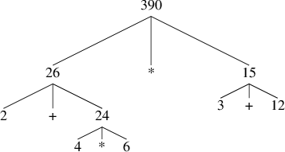

# 1.1 The Elements of Programming

A powerful programming language is more than just a means for instructing a computer to perform tasks. The language also serves as a framework within which we organize our ideas about processes. Thus, when we describe a language, we should pay particular attention to the means that the language provides for combining simple ideas to form more complex ideas. Every powerful language has three mechanisms for accomplishing this:

- primitive expressions, which represent the simplest entities the language is concerned with,
- means of combination, by which compound elements are built from simpler ones, and
- means of abstraction, by which compound elements can be named and manipulated as units.

In programming, we deal with two kinds of elements: functions and data. (Later we will discover that they are really not so distinct.) Informally, data is stuff that we want to manipulate, and functions are descriptions of the rules for manipulating the data. Thus, any powerful programming language should be able to describe primitive data and primitive functions and should have methods for combining and abstracting functions and data.

In programming, we deal with two kinds of elements: functions and data. (Later we will discover that they are really not so distinct.) Informally, data is stuff that we want to manipulate, and functions are descriptions of the rules for manipulating the data. Thus, any powerful programming language should be able to describe primitive data and primitive functions and should have methods for combining and abstracting functions and data.

In this chapter we will deal only with simple numerical data so that we can focus on the rules for building functions.[[1]](#1-1x1) In later chapters we will see that these same rules allow us to build functions to manipulate compound data as well.

<small id="1-1x1">
[1] The characterization of numbers as simple data is a barefaced bluff. In fact, the treatment of numbers is one of the trickiest and most confusing aspects of any programming language. Some typical issues involved are these: How large a number can we represent? How many decimal places of accuracy can we represent? Above and beyond these questions, of course, lies a collection of issues concerning roundoff and truncation errors—the entire science of numerical analysis. Since our focus in this book is on large-scale program design rather than on numerical techniques, we are going to ignore these problems. The numerical examples in this chapter will exhibit the usual roundoff behavior that one observes when using arithmetic operations that preserve a limited number of decimal places of accuracy in noninteger operations.
</small>

## 1.1.1 Expressions

One easy way to get started at programming in JavaScript is to interact with the JavaScript interpreter that is built into the browser you are using to view this page. JavaScript programs are called statements. We have set up the statements shown with a dark background such that you can click on them. The mouse click on JavaScript statements is programmed in such a way that a JavaScript interpreter is displayed, which can evaluate the statement and display the resulting value. By the way, the program that makes the mouse click on a JavaScript statement display the interpreter is itself written in JavaScript; we call it the script for the mouse click.

One kind of statement is an expression statement, which consists of an expression, followed by a semicolon. A simple kind of an expression is a number. (More precisely, the expression consists of the numerals that represent the number in base 10.) If you ask our script to display the interpreter for the expression statement

```js
486;
```
[Click here to run](https://sourceacademy.nus.edu.sg/playground#chap=1&prgrm=FAFgHAbA3MxA)

by clicking it, it will respond by creating a separate browser tab where the statement is shown, with the option to evaluate the statement. Click on the primitive expression statement, and see what happens!

Expressions representing numbers may be combined with operators (such as + or *) to form a compound expression that represents the application of a corresponding primitive function to those numbers. For example, evaluate any of the following expression statements[[1]](#1-1-1x1) by clicking on it:

```js
137 + 349;
```

[Click here to run](https://sourceacademy.nus.edu.sg/playground#chap=1&prgrm=FARgzA7ABA1FYBYCcBuYwg)

```js
1000 - 334;
```

[Click here to run](https://sourceacademy.nus.edu.sg/playground#chap=1&prgrm=FARgDBAEC0kMxwCwG5jCA)

```js
5* 99;
```

[Click here to run](https://sourceacademy.nus.edu.sg/playground#chap=1&prgrm=FAVgBAVGCc0NzGEA)

```js
10 / 5;
```

[Click here to run](https://sourceacademy.nus.edu.sg/playground#chap=1&prgrm=FARgDABA9BCsDcxhA)

```js
2.7 + 10;
```

[Click here to run](https://sourceacademy.nus.edu.sg/playground#chap=1&prgrm=FAJgdA7ABA1FCMAGA3MYQ)

Expressions such as these, which contain other expressions as components, are called combinations. Combinations that are formed by an operator symbol in the middle, and operand expressions to the left and right of it, are called operator combinations. The value of an operator combination is obtained by applying the function specified by the operator to the arguments that are the values of the operands.

The convention of placing the operator between the operands is known as infix notation. It follows the mathematical notation that the reader is most likely familiar with from school and everyday life. As in mathematics, operator combinations can be nested, that is, they can take arguments that themselves are operator combinations:

```js
(3 * 5) + (10 - 6)
```

[Click here to run](https://sourceacademy.nus.edu.sg/playground#chap=1&prgrm=FACgzABAVBCsCUEDUEQEYAMEC0EBs8A3MMEA)

As usual, parentheses are used to group operator combinations in order to avoid ambiguities. JavaScript also follows the usual conventions when parentheses are omitted; multiplication and division bind stronger than addition and subtraction. For example,

```js
3 * 5 + 10 / 2;
```

[Click here to run](https://sourceacademy.nus.edu.sg/playground#chap=1&prgrm=FAZgBAVGCsYNRgIwAYwHowCYDcxhA)


stands for

```js
(3 * 5) + (10 / 2)
```

[Click here to run](https://sourceacademy.nus.edu.sg/playground#chap=1&prgrm=FACgzABAVBCsCUEDUEQEYAMED0EBM8A3MMEA)


We say that * and / have higher precedence than + and -. Sequences of additions and subtractions are read from left to right, as are sequences of multiplications and divisions. Thus,

```js
3 / 5 * 2 - 4 + 3;
```

[Click here to run](https://sourceacademy.nus.edu.sg/playground#chap=1&prgrm=FAZgBA9GCsYFRgExgLRgCxgNRhAbmGCA)


stands for

```js
(((3 / 5) * 2) - 4) + 3;
```

[Click here to run](https://sourceacademy.nus.edu.sg/playground#chap=1&prgrm=FACjGYAIHpIVgJSQFSQExILSQCxINSTgDcwwQA)


We say that the operators +, -, * and / are left-associative.

There is no limit (in principle) to the depth of such nesting and to the overall complexity of the expressions that the JavaScript interpreter can evaluate. It is we humans who might get confused by still relatively simple expressions such as

```js
3 * 2 * (4 + (3 - 5)) + 10 * (27 / 6);
```

[Click here to run](https://sourceacademy.nus.edu.sg/playground#chap=1&prgrm=FAZgBAVGBMlgFAFjAageAtGArASl6mAIwAMc80A7GAPRgBsuA3MMEA)


which the interpreter would readily evaluate to be 57. We can help ourselves by writing such an expression in the form

```js
3 * 2 * (4 + (3 - 5)) 
+ 
10 * (27 / 6);
```

[Click here to run](https://sourceacademy.nus.edu.sg/playground#chap=1&prgrm=FAZgBAVGBMlgFAFjAageAtGArASl2MGsAIwAMc80A7GAPRgBsuA3MMEA)


to visually separate the major components of the expression.
The interpreter always operates in the same basic cycle: It reads a statement from the browser, evaluates the statement, and prints the result. This mode of operation is often expressed by saying that the interpreter runs in a read-eval-print loop. Observe in particular that it is not necessary to explicitly instruct the interpreter to print the value of the statement.

<small id="1-1-1x1">
[1] Note that the semicolon indicates to the JavaScript interpreter that the expression should be taken as a statement, and thus as a complete program. However, JavaScript systems are not strict about these semicolons; they can often be left out. In this book, we will never leave out these optional semicolons, and point out which statements come with semicolons and which ones don't.
</small>

## 1.1.2 Naming and the Environment

A critical aspect of a programming language is the means it provides for using names to refer to computational objects, and our first such means are constants. We say that the name identifies a constant whose value is the object.

In JavaScript, we name constants using *constant declarations*. Typing

```js
const size = 2;
```

causes the interpreter to associate the value 2 with the name size. The purpose of the constant declaration is to create this association, and not to compute a particular value as for expression statements. The JavaScript specification demands that the special value undefined shall be the result of evaluating such constant declarations.

Once the name size has been associated with the number 2, we can refer to the value 2 by name as in

```js
size
```

or

```js
5 * size;
```

Of course, the JavaScript interpreter needs to execute the constant declaration for size before the name size can be used in an expression. In this online book, the statements that need to be evaluated before a new statement are omitted for brevity. However, in order to see and play with the program, you can click on it. The program, preceeded by all required statements, then appears in a new browser tab. Thus, as a result of clicking on

```js
5 * size;
```

a new tab appears that contains the statement

```js
const size = 2;
5 * size;
```

You notice here that JavaScript statements can be placed in a sequence. The interpreter evaluates the components of the sequence in the given order, and treats the value of the last component as the value of the sequence.

Here are further examples of the use of const:

```js
const pi = 3.14159;
```

```js
const radius = 10;
```

```js
pi * radius * radius;
```

```js
const circumference = 2 * pi * radius;
```

```js
circumference;
```

Constant declaration is our language's simplest means of abstraction, for it allow us to use simple names to refer to the results of compound operations, such as the circumference computed above. In general, computational objects may have very complex structures, and it would be extremely inconvenient to have to remember and repeat their details each time we want to use them. Indeed, complex programs are constructed by building, step by step, computational objects of increasing complexity. Our interpreter facilitates this step-by-step program construction because name-object associations can be created incrementally in successive interactions.
It should be clear that the possibility of associating values with names and later retrieving them means that the interpreter must maintain some sort of memory that keeps track of the name-object pairs. This memory is called the environment (more precisely the global environment, since we will see later that a computation may involve a number of different environments).[[1]](1-1-2x1)

<small id="1-1-2x1">
[1] Chapter 3 will show that this notion of environment is crucial, both for understanding how the interpreter works and for implementing interpreters.
</small>

## 1.1.3 求值运算符的组合

One of our goals in this chapter is to isolate issues about process descriptions. As a case in point, let us consider that, in evaluating operator combinations, the interpreter proceeds as follows.

- To evaluate an operator combination, do the following:
    1. Evaluate the operand expressions of the combination.
    2. Apply the function that is denoted by the operator to the arguments that are the values of the operands.

Even this simple rule illustrates some important points about processes in general. First, observe that the first step dictates that in order to accomplish the evaluation process for an operator expression we must first perform the evaluation process on each operand of the operator combination. Thus, the evaluation rule is recursive in nature; that is, it includes, as one of its steps, the need to invoke the rule itself.
Notice how succinctly the idea of recursion can be used to express what, in the case of a deeply nested combination, would otherwise be viewed as a rather complicated process. For example, evaluating

```js
(2 + 4 * 6) * (3 + 12);
```

requires that the evaluation rule be applied to four different combinations. We can obtain a picture of this process by representing the combination in the form of a tree, as shown in Figure 1.1. Each combination is represented by a node with branches corresponding to the operator and the operands of the operator combination stemming from it. The terminal nodes (that is, nodes with no branches stemming from them) represent either operators or numbers. Viewing evaluation in terms of the tree, we can imagine that the values of the operands percolate upward, starting from the terminal nodes and then combining at higher and higher levels. In general, we shall see that recursion is a very powerful technique for dealing with hierarchical, treelike objects. In fact, the percolate values upward form of the evaluation rule is an example of a general kind of process known as *tree accumulation*.

<div align="center">



<p>图1.1 Tree representation, showing the value of each subexpression.</p>

</div>

Next, observe that the repeated application of the first step brings us to the point where we need to evaluate, not operator combinations, but primitive expressions such as numerals or names. We take care of the primitive cases by stipulating that

- the values of numerals are the numbers that they name,
- the values of names are the objects associated with those names in the environment.

Notice the role of the environment in determining the meaning of the names in expressions. In JavaScript, it is meaningless to speak of the value of an expression such as x + 1 without specifying any information about the environment that would provide a meaning for the name x. As we shall see in chapter 3, the general notion of the environment as providing a context in which evaluation takes place will play an important role in our understanding of program execution.

Notice that the evaluation rule given above does not handle constant declarations. For instance, evaluating const x = 3; does not apply the = operator to two arguments, one of which is the value of the name x and the other of which is 3, since the purpose of the constant declaration is precisely to associate x with a value. (That is, the part x = 3 in the constant declaration const x = 3; is not an operator combination.)

The string “const” in the constant declaration is rendered in bold letters to indicate that it is a keyword in JavaScript. Keywords are reserved words that carry a particular meaning, and thus cannot be used as names. A keyword or a combination of keywords instructs the JavaScript interpreter to treat the respective statement in a special way. Each such syntactic form has its own evaluation rule. The various kinds of statements (each with its associated evaluation rule) constitute the syntax of the programming language.

## 1.1.4 Functions

We have identified in JavaScript some of the elements that must appear in any powerful programming language:

- Numbers and arithmetic operations are primitive data and functions.
- Nesting of combinations provides a means of combining operations.
- Constant declarations that associate names with values provide a limited means of abstraction.

Now we will learn about function declarations, a much more powerful abstraction technique by which a compound operation can be given a name and then referred to as a unit.

We begin by examining how to express the idea of squaring. We might say, To square something, take it times itself. This is expressed in our language as square

```js
function square(x) {
    return x * x;
}
```

We can understand this in the following way:

```js
function square(    x   ) { return x    *     x; }
//  ^       ^       ^         ^    ^    ^     ^
// To    square something,  take   it times itself.
```
We have here a compound function, which has been given the name square. The function represents the operation of multiplying something by itself. The thing to be multiplied is given a local name, x, which plays the same role that a pronoun plays in natural language. Evaluating the declaration creates this compound function and associates it with the name square.[[1]](#1-1-4x1)

Our simplest form of a function declaration is

```js
function name( parameters ) { return expression; }
```

The *name* is a symbol to be associated with the function in the environment.[[2]](#1-1-4x1) The *parameters* are the names used within the body of the function to refer to the corresponding arguments of the function. The *expression* after the keyword return is the return expression that will yield the value of the function application when the parameters are replaced by the arguments to which the function is applied.[[3]](#1-1-4x1) The parameters are grouped within parentheses and separated by commas, just as they would be in an actual call to the function being declared.

Having declared the square function, we can now use it in a function application expression, which we turn into a statement using a semicolon:

```js
square(21);
```

The name square is the function expression of the application, and 21 is the argument expression.

```js
square(2 + 5);
```

Here, the argument expression is itself a compound expression, the operator expression 2 + 5.

```js
square(square(3));
```

Of course application expressions can also serve as argument expressions.

We can also use square as a building block in declaring other functions. For example, x^2+y^2 can be expressed as

```js
square(x) + square(y);
```

We can easily declare a function sum_of_squares that, given any two numbers as arguments, produces the sum of their squares:

```js
function sum_of_squares(x,y) {
    return square(x) + square(y);
}
```

Now we can use sum_of_squares as a building block in constructing further functions:


```js
function f(a) {
    return sum_of_squares(a + 1, a * 2);
}
```

The application of functions such as sum_of_squares(3,4) is—after operator combination—the second kind of combination of expressions into larger expressions that we encounter. In addition to compound functions, JavaScript provides a number of primitive functions that are built into the interpreter. An example is the function math_log that computes the natural logarithm of its argument.[[4]](#1-1-4x1) Evaluating the application expression math_log(1) results in the number 0. Primitive functions are used in exactly the same way as compound functions. Indeed, one could not tell by looking at the definition of sum_of_squares given above whether square was built into the interpreter, like math_log, or defined as a compound function.


<small id="1-1-4x1">
[1] Observe that there are two different operations being combined here: we are creating the function, and we are giving it the name square. It is possible, indeed important, to be able to separate these two notions—to create functions without naming them, and to give names to functions that have already been created. We will see how to do this in section 1.3.2.
<br>

[2] Throughout this book, we will describe the general syntax of programs by using italic symbols—e.g., name—to denote the slots in the expression to be filled in when such an expression is actually used.
<br>

[3] We shall see in the next section that the body of the function can be a sequence of statements. In this case, the interpreter evaluates each statement in the sequence in turn until a return statement determines the value of the function application.
<br>

[4] The Source language used in this adaptation introduces names math_* for all functions and constants in JavaScript's Math library.
</small>

## 1.1.5 The Substitution Model for Function Application

To evaluate an application combination, the interpreter follows a similar process as for operator combinations, which we described in section [1.1.3](#求值运算符的组合). That is, the interpreter evaluates the elements of the combination and applies the function (which is the value of the function expression) to the arguments (which are the values of the argument expressions of the application combination).

In more detail, the interpreter proceeds as follows when evaluating application combinations:

- To evaluate an application combination of the form
- > function-expression ( argument-expressions )
- do the following:
    1. Evaluate the function expression of the application combination, resulting in the function to be applied.
    2. Evaluate the argument expressions of the combination.
    3. Apply the function to the arguments:
        - If the function is primitive, we simply apply the corresponding mathematical function to the arguments.
        - If the function is compound, we evaluate the return expression of the function with each parameter replaced by the corresponding argument.

To illustrate this process, let's evaluate the application combination

```js
f(5);
```

Evaluating the name f results in the function declared in section 1.1.4. Evaluating the argument expression 5 yields the argument value 5. Now, we retrieve the return expression of f:

```js
sum_of_squares(a + 1, a * 2)
```

in which we replace the parameter a by the argument 5:

```js
sum_of_squares(5 + 1, 5 * 2)
```

Thus the problem reduces to the evaluation of an application combination with two arguments and a function expression sum_of_squares. Evaluating this combination involves three subproblems. We must evaluate the function expression to get the function to be applied, and we must evaluate the argument expressions to get the arguments. Now 5 + 1 produces 6 and 5 * 2 produces 10, so we must apply the sum_of_squares function to 6 and 10. These values are substituted for the parameters x and y in the return expression of sum_of_squares, reducing the expression to

```js
square(6) + square(10)
```
If we use the declaration of square once, this reduces to

```js
(6 * 6) + square(10)
```

which reduces by multiplication to

```js
36 + square(10)
```

A second application of square yields

```js
36 + (10 * 10)
```

which reduces by multiplication to

```js
36 + 100
```

and finally by addition to

```js
136
```

The process we have just described is called the substitution model for function application. It can be taken as a model that determines the meaning of function application, insofar as the functions in this chapter are concerned. However, there are two points that should be stressed:

- The purpose of the substitution is to help us think about function application, not to provide a description of how the interpreter really works. Typical interpreters do not evaluate function applications by manipulating the text of a function to substitute values for the parameters. In practice, the substitution is accomplished by using a local environment for the parameters. We will discuss this more fully in chapters 3 and 4 when we examine the implementation of an interpreter in detail.
- Over the course of this book, we will present a sequence of increasingly elaborate models of how interpreters work, culminating with a complete implementation of an interpreter and compiler in chapter 5. The substitution model is only the first of these models—a way to get started thinking formally about the evaluation process. In general, when modeling phenomena in science and engineering, we begin with simplified, incomplete models. As we examine things in greater detail, these simple models become inadequate and must be replaced by more refined models. The substitution model is no exception. In particular, when we address in chapter 3 the use of functions with mutable data, we will see that the substitution model breaks down and must be replaced by a more complicated model of function application.[[1]](1-1-5x1)

## Applicative order versus normal order

According to the description of evaluation given above, the interpreter first evaluates the function and argument expressions and then applies the resulting function to the resulting arguments. This is not the only way to perform evaluation. An alternative evaluation model would not evaluate the operands until their values were needed. Instead it would first substitute argument expressions for parameters until it obtained an expression involving only operators, and would then perform the evaluation. If we used this method, the evaluation of

```js
f(5)
```

```js
sum_of_squares(5 + 1, 5 * 2)
square(5 + 1)  +  square(5 * 2)
(5 + 1) * (5 + 1) + square(5 * 2)
(5 + 1) * (5 + 1) + (5 * 2) * (5 * 2)
```

followed by the reductions

```js
6 * (5 + 1) + (5 * 2) * (5 * 2)
6 * 6 + (5 * 2) * (5 * 2)
36 + (5 * 2) * (5 * 2)
36 + 10 * (5 * 2)
36 + 10 * 10
36 + 100
136
```

This gives the same answer as our previous evaluation model, but the process is different. In particular, the evaluations of 5 + 1 and 5 * 2 are each performed twice here, corresponding to the reduction of the expression

```js
x * x
```

with x replaced respectively by 5 + 1 and 5 * 2.

This alternative fully expand and then reduce evaluation method is known as normal-order evaluation, in contrast to the evaluate the arguments and then apply method that the interpreter actually uses, which is called applicative-order evaluation. It can be shown that, for function applications that can be modeled using substitution (including all the functions in the first two chapters of this book) and that yield legitimate values, normal-order and applicative-order evaluation produce the same value. (See exercise 1.5 for an instance of an "illegitimate" value where normal-order and applicative-order evaluation do not give the same result.)

JavaScript uses applicative-order evaluation, partly because of the additional efficiency obtained from avoiding multiple evaluations of expressions such as those illustrated with above and, more significantly, because normal-order evaluation becomes much more complicated to deal with when we leave the realm of procedures that can be modeled by substitution. On the other hand, normal-order evaluation can be an extremely valuable tool, and we will investigate some of its implications in chapters 3 and 4. [[2]](1-1-5x1)

<small id="1-1-5x1">
[1] Despite the simplicity of the substitution idea, it turns out to be surprisingly complicated to give a rigorous mathematical definition of the substitution process. The problem arises from the possibility of confusion between the names used for the parameters of a function and the (possibly identical) names used in the expressions to which the function may be applied. Indeed, there is a long history of erroneous definitions of substitution in the literature of logic and programming semantics. See Stoy 1977 for a careful discussion of substitution.
[2] In chapter 3 we will introduce stream processing, which is a way of handling apparently infinite data structures by incorporating a limited form of normal-order evaluation. In section 4.2 we will modify the JavaScript interpreter to produce a normal-order variant of JavaScript.
</small>

## 1.1.6 Conditional Expressions and Predicates

The expressive power of the class of functions that we can declare at this point is very limited, because we have no way to make tests and to perform different operations depending on the result of a test. For instance, we cannot declare a function that computes the absolute value of a number by testing whether the number is negative or not, and taking different actions in each case according to the rule

```
f(x) = | x |

// 等价于

f(x) =  x if x >= 0

f(x) = -x otherwise
```

This construct is a case analysis and can be expressed in JavaScript using a *conditional expression* as follows:

```js
function abs(x) {
    return x >= 0 ? x : -x;
}
```

The general form of a conditional expression is

> *predicate* ? *consequent-expression* : *alternative-expression*

Conditional expressions begin with a *predicate*—that is, an expression whose value is interpreted as either *true* or *false*, two distinguished boolean values in JavaScript.[1] Note that the primitive boolean expressions true and false trivially evaluate to the boolean values *true* and *false*, respectively. The *predicate* is followed by a question mark, the *consequent-expression*, a colon, and finally the *alternative-expression*.

To evaluate a conditional expression, the interpreter starts by evaluating the *predicate* part of the expression. If the predicate evaluates to true, the interpreter evaluates *consequent-expression*. Otherwise it evaluates *alternative-expression*.

The word predicate is used for functions that return true or false, as well as for expressions that evaluate to *true* or *false*. The absolute-value function abs makes use of the primitive predicate >=. This predicate takes two numbers as arguments and tests whether the first number is greater than or equal to the second number, returning *true* or *false* accordingly.

JavaScript provides a number of primitive predicates that work similar to >=, including >, <, <=, and ===. In addition to these primitive predicates, there are logical composition operations, which enable us to construct compound predicates. The three most frequently used are these:

- **expression<sub>1</sub>** && **expression<sub>2</sub>** The interpreter evaluates **expression<sub>1</sub>**. If it evaluates to false, the value of the whole expression is false, and **expression<sub>2</sub>** is not evaluated. If **expression<sub>1</sub>** evaluates to true, the value of the whole expression is the value of **expression<sub>2</sub>**.
- **expression<sub>1</sub>** || **expression<sub>2</sub>** The interpreter evaluates **expression<sub>1</sub>**. If it evaluates to true, the value of the whole expresssion is true, and **expression<sub>2</sub>** is not evaluated. If **expression<sub>1</sub>** evaluates to false, the value of the whole expression is the value of **expression<sub>2</sub>**.
- **! expression** The value of the *expression* is *true* when expression evaluates to *false*, and *false* otherwise.

Notice that && and || are not evaluated like arithmetic operators such as +, because their right-hand expression is not always evaluated. The operator !, on the other hand, follows the evaluation rule of section 1.1.3. It is a unary operator, which means that it takes only one argument, whereas the arithmetic operators encountered so far are binary, taking two arguments. The operator ! precedes its argument; we call it a prefix operator. Another prefix operator is the unary "minus" operator, an example of which is the expression -x of the function abs in the beginning of this section.

As an example of how these predicates are used, the condition that a number x be in the range 5<x<10 may be expressed as

```js
x > 5 && x < 10
```

Note that the binary operator && has lower precedence than the comparison operators > and <.

As another example, we can declare a predicate to test whether one number is not equal to another number.

```js
function not_equal(x, y) {
    return x > y || x < y;
}
```

or alternatively as

```
function not_equal(x, y) {
    return !(x >= y && x <= y);
}
```

Note that the operator !== when applied to two numbers, behaves the same as not_equal.

## Exercise

### Exercise1.1

Below is a sequence of statements. Before you click on a statement, predict what the result of its evaluation will be.

```js
10;
```

```js
5 + 3 + 4;
```

```js
9 - 1;
```

```js
6 / 2;
```

```js
2 * 4 + (4 - 6);
```

```js
const a = 3;
```

```js
const b = a + 1;
```

```js
a + b + a * b;
```

```js
a === b;
```


```js
b > a && b < a * b 
   ? b : a;
```


```js
a === 4 ? 6 : b === 4 ? 6 + 7 + a : 25;
```


```js
2 + (b > a ? b : a);
```


```js
(a > b
 ? a
 : a < b
   ? b
   : -1)
*
(a + 1);
```

Note that the statement

```js
a === 4 ? 6 : b === 4 ? 6 + 7 + a : 25;
```

consists of two conditional expressions, where the second one forms the alternative of the first one. If you want to make that clear, you can indent the lines like this:

```js
a === 4
? 6
: b === 4 
  ? 6 + 7 + a
  : 25;
```

<details>

<summary>
点击查看答案
</summary>

无

</details>

### Exercise1.2

Translate the following expression into JavaScript

```
5+4+(2−(3−(6+4/5)))
————————————————————
    3(6−2)(2−7)
```

<details>

<summary>
点击查看答案
</summary>

```js
(5 + 4 + (2 - (3 - (6 + 4 / 5)))) 
/
(3 * (6 - 2) * (2 - 7));
```

</details>

### Exercise1.3

Declare a function that takes three numbers as arguments and returns the sum of the squares of the two larger numbers.

<details>

<summary>
点击查看答案
</summary>

```js
function f(x, y, z) {
   return square(x) + square(y) + square(z) -
          // subtract the square of the smallest
          square(x > y ? (y > z ? z : y) : (x > z ? z : x));
}
```

</details>

### Exercise1.4

Observe that our model of evaluation allows for application combinations whose function expressions are compound expressions. Use this observation to describe the behavior of the following function:

```js
function plus(a, b) { return a + b; }
function minus(a, b) { return a - b; }
function a_plus_abs_b(a, b) {
    return (b >= 0 ? plus : minus)(a, b);
}
```

Note that in the conditional expression, we cannot directly use the operators + and - instead of the names plus and minus because in infix notation, only operator symbols are allowed in the middle, not compound expressions.[2]

<details>

<summary>
点击查看答案
</summary>

According to section 1.1.5, evaluation of a application expression proceeds as follows:

- Evaluate the function expression of the application combination, resulting in the function to be applied.
- Evaluate the argument expressions of the combination.
- Evaluate the return expression of the function with each parameter replaced by the corresponding argument.

Thus the evaluation of the application expression a_plus_abs_b(5, -4) (1) evaluates a_plus_abs_b, resulting in the function given above, and (2) the arguments are already values. So we need to evaluate (3) the return expression of the function, with the parameters replaced by the arguments, thus: (-4 >= 0 ? plus : minus)(5, -4). With the same rules, we need to (1) evaluate the function expression, which in this case is the conditional expression -4 >= 0 ? plus : minus. Since the predicate evaluates to false, the function expression evaluates to minus. The arguments, again (2) are already values. Thus we end up evaluating (3) the body of minus with the parameters a and b replaced by 5 and -4, respectively, resulting in 5 - (-4), which will finally evaluate to 9.

</details>

### Exercise1.5

Ben Bitdiddle has invented a test to determine whether the interpreter he is faced with is using applicative-order evaluation or normal-order evaluation. He declares the following two functions :

```js
function p() {
    return p();
}

function test(x, y) {
    return x === 0 ? 0 : y;
}
```

Then he evaluates the statement

```js
test(0, p());
```

What behavior will Ben observe with an interpreter that uses applicative-order evaluation? What behavior will he observe with an interpreter that uses normal-order evaluation? Explain your answer. (Assume that the evaluation rule for conditional expressions is the same whether the interpreter is using normal or applicative order: The predicate expression is evaluated first, and the result determines whether to evaluate the consequent or the alternative expression.)

<details>

<summary>
点击查看答案
</summary>

> In applicative-order evaluation of test(0, p()), we need to evaluate the argument expressions before we can evaluate the return expression of the function test. The evaluation of the argument expression p() will not terminate, however: It will keep evaluating application expressions of the form p(), and thus the evalution of test(0, p()) will not produce a legitimate value. In normal-order evaluation, on the other hand, the function application test(0, p()) would immediately evaluate the return expression of the function test, x === 0 ? 0 : y after replacing the parameter x with 0 and y with p(). The result of the replacing would be 0 === 0 ? 0 : p(). The evaluation of the predicate 0 === 0 results in true and thus the conditional expression evaluates to 0, without any need to evaluate p().

</details>

